# Effortlessly Invariant Rulebooks (ERB)

<p align="center">
  
</p>

Most "single source of truth" systems mean: *we wrote it in one place and try to keep everything else in sync.* ERB means something stronger: the rulebook **is** the spec, and every substrate — Postgres, Python, Go, COBOL, Excel, OWL, English prose, UML, ARM64 assembly, and more — is mechanically derived from it and **proven** to return the same answer.

You write business rules once as a typed grid of named cells — entities, fields, formulas, relationships. Any transpiler can consume that grid without understanding the grammar of any other substrate, because the business intent (there is a calculated field, it derives from these inputs, it returns this type) is encoded in the *structure*, not in the formula text. Add a new language target: feed it the same rulebook. Rename a field: rebuild, and the rename propagates everywhere. Remove a rule: it disappears from every substrate on the next build. No migrations. No drift. No "the Postgres version doesn't do what the Python version does."

The conformance harness runs on every build and produces a pass/fail matrix across all substrates. If they don't agree, the build fails.

This repo contains the orchestration platform and a catalog of ready-to-run demo domains — from a [one-table Hello World](rulebook-examples/customer-fullname/) to [acme-llc](rulebook-examples/acme-llc/), which exercises all 17 substrates and is fully proven conformant.

→ [What does "non-linguistic" actually mean?](docs/what-is-non-linguistic.md) · [GitHub](https://github.com/effortlessapi/effortless-rulebooks)

---

## Conformance results — acme-llc (last run)

17 substrates. All 100%. Same business rules, same answer, different runtime.

| Substrate | Score | Time |
|---|---|---|
| python | 100% | 0.00s |
| yaml | 100% | 0.13s |
| uml | 100% | 0.17s |
| explain-dag | 100% | 0.17s |
| airtable | 100% | 0.11s |
| golang | 100% | 0.29s |
| owl | 100% | 0.41s |
| cobol | 100% | 0.44s |
| csv | 100% | 0.42s |
| xlsx | 100% | 0.48s |
| binary | 100% | 0.65s |
| effortless-xlsx | 100% | 1.17s |
| effortless-csv | 100% | 2.05s |
| effortless-entity-framework | 100% | 2.34s |
| postgres | 100% | 4.45s |
| effortless-postgres | 100% | 4.37s |
| english (LLM-graded) | 100% | 18.84s |

The harness that produced this table runs on every build. There is no "build without testing."

---

## Key features

### Core architecture

- **[Hub-and-spoke topology](docs/features/README.hub-and-spoke.md)** — the rulebook is the hub; every input and output is a spoke. Spokes never talk to each other, eliminating the n×n integration problem. Adding substrate 18 means writing one injector — no changes to any other substrate, the orchestration, or the test harness. Those are already generic.
- **[Convergent builds](docs/features/README.convergent-build.md)** — additions appear, removals disappear, renames propagate. Not additive codegen — the rulebook stays authoritative in both directions.
- **[No privileged substrate](docs/features/README.substrate-equivalence.md)** — Postgres, Python, Go, OWL, COBOL, Excel, English, ARM64 are all peer projections. A language not yet invented can be added by writing one transpiler.
- **[Write-through invariant](docs/features/README.write-through.md)** — edits made through the admin portal write to Postgres and update the rulebook JSON atomically. Drop Postgres at any time and rebuild from the JSON; never the reverse.
- **[Self-hosting](docs/features/README.self-hosting.md)** — the orchestration tool, admin portal, and ssotme-proxy are themselves generated from the platform rulebook. ERB is its own first customer.

### Verification and provenance

- **[Conformance testing](docs/features/README.conformance.md)** — every build runs every substrate's test and shows the pass/fail matrix. There is no "build without testing."
- **[ExplainDAG](docs/features/README.explain-dag.md)** — for every derived value, a complete witnessed derivation graph: which inputs, which operations, what value at each step. Generated before any production code runs.
- **[React ExplainDAG](docs/features/README.react-explain-dag.md)** — any value displayed in the UI can answer "where did this come from?" all the way to ground truth, because the UI reads from the same DAG the rulebook already proved.
- **[Abstract Derivative Percentage (ADP)](docs/features/README.ADP.md)** — a measurable percentage of the project that is derivative (rebuildable) vs. hand-written. Typical ERB projects land at 60–80%.

### Practical consequences

- **[Live Excel export](docs/features/README.live-excel-export.md)** — not a CSV dump. A fully live workbook where calculated fields are Excel formulas, related tables are cross-sheet references, and the derivation chain travels with the data.
- **[GDPR export and erasure](docs/features/README.gdpr-export-erasure.md)** — the DAG shape that enables explainability is the same shape GDPR's right to portability and right to erasure require. With RLS, account-scoped export and deletion are structural consequences, not bespoke engineering.
- **[Rulebook is a complete spec](docs/features/README.complete-spec.md)** — sufficient for any frontier LLM to answer any question about the domain or produce a faithful implementation in any language.
- **[Skills as LLM force multiplier](docs/features/README.claude-skills.md)** — the rulebook gives the LLM something to operate on; the skills give it the instructions for how to operate. The learning curve that used to cost weeks is now a file you can curl.
- **[Fail loudly, never fall back](docs/features/README.fail-loud.md)** — if a file or value isn't where expected, the code fails with the exact path. Silent fallbacks hide bugs; defaults derived from the SSoT are not fallbacks.

### Platform mechanics

- **[Portal/CLI parity](docs/features/README.portal-cli-parity.md)** — the admin portal and `./start.sh --cli` are peer interfaces to the same pipeline. Every portal mutation shells out to the same CLI command.
- **[Locally-designated SSoT](docs/features/README.local-ssot.md)** — the answer key for a conformance run is whichever spoke the user designates: Airtable export, Excel workbook, hand-edited JSON, Postgres dump.
- **[Per-rulebook formula dialect](docs/features/README.dialect-binding.md)** — each rulebook declares its formula dialect (Excel, Airtable, …). Substrates honor it; conformance claims are scoped to that dialect.
- **[ssotme-proxy transpiler bus](docs/features/README.ssotme-proxy.md)** — a local HTTP server on `localhost:4242` makes repo-local transpilers and officially-licensed ones look identical to the CLI.

→ [Full feature catalog with tiers, priorities, and status](docs/derived/features.md)

---

## Demo domains

The catalog spans **26 ready-to-run domains** — from a one-table Hello World to a 26-table hardware ontology — all driven by the same hub-and-spoke pattern. The highlights table below is a curated subset; the [full domain catalog](docs/derived/domains.md) is generated from the platform rulebook on every build. For a direct comparison of LLM behavior with and without ERB grounding, see **[A Tale of Two Claudes](rulebook-examples/naked-claude-vs-effortless-claude/TALE_OF_TWO_CLAUDES.md)**.

| Domain | Complexity | What it demonstrates |
|---|---|---|
| [acme-llc](rulebook-examples/acme-llc/) | **full demo** | **All 17 substrates proven conformant** — start here |
| [effortless-banking](rulebook-examples/effortless-banking/) | advanced | Loan origination, covenant monitoring, risk-grade migration, four-surface portal |
| [mechanical-kitchen-timer](rulebook-examples/mechanical-kitchen-timer/) | advanced | 26-table hardware ontology — proves the methodology isn't limited to information systems |
| [fantasy-football](rulebook-examples/fantasy-football/) | advanced | Four-hop DAG: raw stats → roster aggregations → matchup scoring → standings |
| [therapist-helper-portal](rulebook-examples/therapist-helper-portal/) | moderate | Three-hop cascading inference: GoalUpdate → Goal.ProgressPct → Client.IsAtRisk |
| [jessica-basic](rulebook-examples/jessica-basic/) | moderate | Relationships, aggregations, role-agent separation |
| [star-trek](rulebook-examples/star-trek/) | moderate | Hierarchical rollups, polymorphic foreign keys |
| [is-everything-a-language](rulebook-examples/is-everything-a-language/) | philosophical | 8-predicate AND logic, formal argument modeling |
| [customer-fullname](rulebook-examples/customer-fullname/) | minimal | Hello World — string concat formula |

→ [Full domain catalog (26 domains, generated)](docs/derived/domains.md)

---

## Derived documentation

These pages are generated from the platform rulebook by `effortless build` — edit the rulebook, rebuild, and they update automatically. They are the authoritative reference, not hand-maintained summaries.

- **[Platform Features](docs/derived/features.md)** — the full catalog of all 16 features with tier, priority, and status. The README above is a curated excerpt.
- **[Execution Substrates](docs/derived/substrates.md)** — 10+ substrates with maturity rating, determinism, and whether they can serve as an answer key.
- **[Ontology Axioms](docs/derived/axioms.md)** — the 13 load-bearing claims the methodology rests on. If any one drops, the approach no longer holds.
- **[Rulebook Domains](docs/derived/domains.md)** — the full domain catalog including the ACME and self-referential demos not listed above.
- **[Substrate Contract](docs/derived/substrate-contract.md)** — the inject / execute / grade protocol every substrate must implement to participate in the conformance harness.

→ [Full derived docs index](docs/derived/README.md)

---

## Claude Skills — skipping the learning curve

Before ERB, every developer had to teach their LLM the conventions from scratch: how PascalCase tables work, what the Leopold loop is, when to read from `vw_*` views vs base tables, how `effortless build` sequences transpilers. That learning used to cost hours to days per project.

The skills pre-encode all of that. Load a skill and the LLM already knows the conventions. The rulebook is the subject matter; the skills are the curriculum. Without the rulebook there is nothing for the skills to operate on — but with both, you skip straight to building.

Skills are also what makes the LLM-as-transpiler idea concrete: the rulebook defines the *what* (entities, fields, formulas, relationships), and the skills define the *how* (what to generate, in what order, with what conventions). A developer describing a new feature in plain English is enough — the LLM already has both the structure and the instructions.

The skills in this repo are mirrored from [effortless-claude](https://github.com/effortlessapi/effortless-claude). To pull fresh copies:

```bash
./docs/skills/clone-skills.sh
```

**Key skills for working with this repo:**

| Skill | When to use |
|---|---|
| [/effortless-cmcc](docs/skills/effortless-cmcc/SKILL.md) | Any "why does this work?" or evaluative question about ERB |
| [/effortless-orchestrator](docs/skills/effortless-orchestrator/SKILL.md) | Running the full build pipeline |
| [/effortless-workflow](docs/skills/effortless-workflow/SKILL.md) | Making changes to any ERB project |
| [/effortless-leopold-loop](docs/skills/effortless-leopold-loop/SKILL.md) | The iterative CHANGE-RULE → REBUILD → CONSUME-VIEWS cycle |
| [/effortless-conventions](docs/skills/effortless-conventions/SKILL.md) | Naming rules, DAG structure, FK patterns |
| [/effortless-rulebooks](docs/skills/effortless-rulebooks/SKILL.md) | Empirical proof that CMCC works — conformance suite, ExplainDAG |

→ [Full skills catalog](docs/skills/README.md)

---

## Further reading

- [What is non-linguistic?](docs/what-is-non-linguistic.md) — why structural encoding beats linguistic representation, and why it matters for substrates
- [CLAUDE.md](CLAUDE.md) — the architectural rules (rulebook-as-SSoT, project vs. demo split, portal vs. domain) enforced across this repo
- [CMCC — the theoretical foundation](https://zenodo.org/records/15252466) — the conjecture that Schema, Data, Lookups, Aggregations, and Formulas over a bitemporal ACID DAG are sufficient for any finitely-computable design-time semantic

> The [platform rulebook](effortless-platform/effortless-rulebook/effortless-rulebook.json) is the formal SSoT for this repo's own tooling, including the feature and substrate catalogs above. Run `cd effortless-platform && effortless build` to regenerate.
