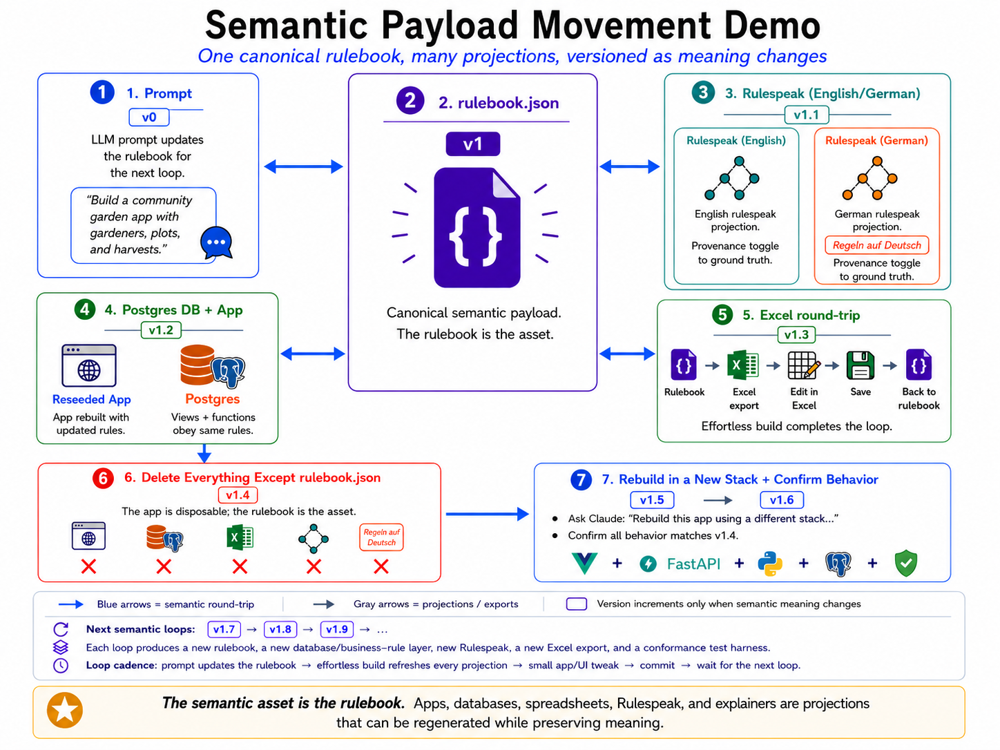

# Effortlessly Invariant Rulebooks (ERB)

<p align="center">
  
</p>

**Meaning is the source of truth.** `rulebook.json` is the one canonical semantic asset. Everything else — the app, the database, a spreadsheet, the UI explainer, RuleSpeak, translations, even a rebuild in an entirely new stack — is a *projection* generated from it. The software is disposable; the meaning persists. You can delete every generated artifact, keep only `rulebook.json`, and regenerate the system. Versions increment only when the *meaning* changes, not on UI/build/export churn — and every projection is conformance-tested against the same rulebook-derived answer key, so you can show that they still agree.

Most "single source of truth" systems mean: *we wrote it in one place and try to keep everything else in sync.* ERB means something stronger: the rulebook **is** the spec, and every substrate — Postgres, Python, Go, COBOL, Excel, OWL, English prose, UML, ARM64 assembly, and more — is mechanically derived from it and **demonstrated** to return the same answer.

You write business rules once as a typed grid of named cells — entities, fields, formulas, relationships. Any transpiler can consume that grid without understanding the grammar of any other substrate, because the business intent (there is a calculated field, it derives from these inputs, it returns this type) is encoded in the *structure*, not in the formula text. Add a new language target: feed it the same rulebook. Rename a field: rebuild, and the rename propagates everywhere. Remove a rule: it disappears from every substrate on the next build. No migrations. No drift. No "the Postgres version doesn't do what the Python version does."

The conformance harness runs on every build and produces a pass/fail matrix across all substrates. If they don't agree, the build fails.

This repo contains the orchestration platform and two catalogs: **[toy-rulebooks/](toy-rulebooks/)** (minimal domains for demonstrating substrate breadth) and **[rulebook-examples/](rulebook-examples/)** (full ontologies showing domain depth). Because this repo is also a live demonstration environment, some domains may show partially-completed loop steps at any given point. A full `effortless build` on any domain resets it to its defined state.

→ [What does "non-linguistic" actually mean?](docs/what-is-non-linguistic.md) · [GitHub](https://github.com/effortlessapi/effortless-rulebooks)

---

## What it looks like in practice

These domains were each built in roughly a weekend — 10–15 hours of actual work — by one person tending a rulebook. The commit history is the record: not a changelog of modules added or removed, but a log of *intent* crystallizing, each commit one step forward with almost no thrash. The rulebook is stable early; the application layer follows. The complexity you see below is the complexity of the domain, not the cost of building it.

| Domain | Tables | What it models |
|---|---|---|
| [causal-autoimmune-architecture](rulebook-examples/causal-autoimmune-architecture/) | 38 | A causal inference engine for heterogeneous autoimmune disease — multi-omic cohort data, federated datasets, variant types, ancestry-equitable predictions. The DAG produces falsifiable causal mechanisms as derived facts. |
| [simpsons-paradox](rulebook-examples/simpsons-paradox/) | 29 | A digital mirror of Simpson's Paradox. The paradox itself falls out of the DAG as a derived fact — it is never modeled directly. Loop commits in this repo (`loop-05` → `loop-20`) show the rulebook evolving from blank to witnessed reversal in four named steps. |
| [talismans-special-solutions](rulebook-examples/talismans-special-solutions/) | 22 | One approval workflow told tip to tail: humans, AI agents, and automated pipelines under one ontology. Roles, departments, escalation logic, and a dual-substrate conformance witness (Postgres + OWL reasoner). |
| [traffic-ticket-contest](rulebook-examples/traffic-ticket-contest/) | 55 | A traffic ticket everyone understands, modeled as four state machines and a multi-jurisdiction rules engine — 75 features, 57 business rules, 194 conformance tests, 980 catalog fields. An intentionally ordinary domain taken to full production depth. |
| [intelligence-taxonomy](rulebook-examples/intelligence-taxonomy/) | 3 | A catalog of intelligences — biological, digital, collective — classified by what they can do, not what they are made of. Intentionally minimal: three tables, the point is the classification logic, not the table count. |

→ [Full domain examples](rulebook-examples/) · [Toy demos](toy-rulebooks/) · [Generated domain catalog](docs/derived/domains.md)

**Two directories, by construction.** [`toy-rulebooks/`](toy-rulebooks/) contains intentionally minimal domains — [acme-llc](toy-rulebooks/acme-llc/) is the canonical one, three tables, run through all 17 substrates — whose job is to open the door by showing the *substrate matrix*. [`rulebook-examples/`](rulebook-examples/) contains the full ontologies above, showing how far the primitives actually reach. The toys demonstrate breadth of platform. The examples demonstrate depth of domain.

---

## Conformance results — acme-llc (last run)

17 substrates. All 100%. Same business rules, same answer, different runtime.

| Substrate | Score | Time |
|---|---|---|
| python | 100% | 0.00s |
| yaml | 100% | 0.13s |
| uml | 100% | 0.17s |
| explain-dag | 100% | 0.17s |
| airtable | 100% | 0.11s |
| golang | 100% | 0.29s |
| owl | 100% | 0.41s |
| cobol | 100% | 0.44s |
| csv | 100% | 0.42s |
| xlsx | 100% | 0.48s |
| binary | 100% | 0.65s |
| effortless-xlsx | 100% | 1.17s |
| effortless-csv | 100% | 2.05s |
| effortless-entity-framework | 100% | 2.34s |
| postgres | 100% | 4.45s |
| effortless-postgres | 100% | 4.37s |
| english (LLM-graded) | 100% | 18.84s |

The harness that produced this table runs on every build. There is no "build without testing."

---

## Meaning as the source of truth — the projection model
The diagram above is not aspirational architecture — it describes the implemented loop. `rulebook.json` is the canonical semantic asset; every other artifact is a projection regenerated from it. The contract for each projection is the same three-phase pattern (**inject** the rulebook into a runnable artifact → **execute** it against blank test data → **grade** it field-by-field against the answer key), which is what lets each substrate adapter stay domain-agnostic rather than hand-coded per business case. The steps in the diagram:

1. **Prompt → rulebook.** An LLM edit (under skills/conventions) changes the canonical rulebook. The prompt is the *what*; the rulebook is the recorded meaning.
2. **rulebook.json is the asset.** One typed grid of entities, fields, formulas, and relationships. This is the recoverable business layer — not documentation, not config.
3. **Effortless build → projections.** The rebuilt app, the Postgres database, RuleSpeak prose, and other substrates are all regenerated from the rulebook in one build.
4. **Excel round-trip.** A non-developer edits meaning in a spreadsheet and writes it back to the canonical rulebook. The spreadsheet is an editing surface, not a second source of truth.
5. **UI explainer DAG.** For any displayed value, the UI can show exactly how it was derived — raw inputs → lookups → calculations → aggregations — because it reads the same DAG the rulebook already produced.
6. **RuleSpeak, including other languages.** Plain-English (and e.g. German) rule narratives are *generated explanations* of the same semantics, not the source. Language views are projections like any other.
7. **Delete everything except rulebook.json, then rebuild in a new stack.** The strongest proof point: drop every generated artifact, keep only the rulebook, and regenerate the system in a different framework — with conformance confirming behavior is preserved.

**Versioning tracks meaning, not noise.** A version increments when the rulebook's *meaning* changes, separating semantic changes from UI/build/export churn. The pieces this depends on are documented as their own capabilities below:

- **Semantic diffing** — distinguishing a meaning change from a presentation-only change ([convergent builds](docs/features/README.convergent-build.md)).
- **Round-trip safety** — validation and conflict handling when an Excel/Airtable edit is written back ([locally-designated SSoT](docs/features/README.local-ssot.md)).
- **Projection drift detection** — showing that Postgres, UI, RuleSpeak, and app behavior all still match the rulebook ([conformance testing](docs/features/README.conformance.md)).
- **Schema evolution** — migrating older rulebooks when the rulebook format itself changes.
- **LLM-edit governance** — guardrails, validation, and tests around prompt-driven rulebook edits ([skills](docs/features/README.claude-skills.md), [fail-loud](docs/features/README.fail-loud.md)).

The shape of the whole thing: a semantic build loop where business meaning lives in a canonical rulebook, and apps, databases, spreadsheets, explainers, and localized policy language are rebuildable projections — deterministic regeneration with LLM-assisted edits and conformance checks at every projection.

**What this does to version history.** In a conventional project, the commit log is a record of *modules changed* — files added, functions removed, imports updated. In an ERB project it becomes a record of *intent evolving*. The simpsons-paradox domain in this repo shows the shape clearly: `loop-05` adds `StratumVariables` and the first `IsParadoxExplained` field; `loop-10` adds `ModelSummary` so the DAG can witness its own epistemic state; `loop-15` adds a `ReversalThreshold` to test robustness; `loop-20` hydrates real study data and two type-A reversals are witnessed. Four commits, each one a named conceptual step. The intermediate artifacts (SQL, Python, the admin app) are not mentioned in those messages — they regenerated automatically. The commits track the *shape of understanding*, not the mechanics of the build. This is what projects in other domains look like too: a few dozen commits, each a deliberate step, producing systems of real depth with almost no thrash.

---

## Key features

### Core architecture

- **[Hub-and-spoke topology](docs/features/README.hub-and-spoke.md)** — the rulebook is the hub; every input and output is a spoke. Spokes never talk to each other, eliminating the n×n integration problem. Adding substrate 18 means writing one injector — no changes to any other substrate, the orchestration, or the test harness. Those are already generic.
- **[Convergent builds](docs/features/README.convergent-build.md)** — additions appear, removals disappear, renames propagate. Not additive codegen — the rulebook stays authoritative in both directions.
- **[No privileged substrate](docs/features/README.substrate-equivalence.md)** — Postgres, Python, Go, OWL, COBOL, Excel, English, ARM64 are all peer projections. A language not yet invented can be added by writing one transpiler.
- **[Write-through invariant](docs/features/README.write-through.md)** — edits made through the admin portal write to Postgres and update the rulebook JSON atomically. Drop Postgres at any time and rebuild from the JSON; never the reverse.
- **[Self-hosting](docs/features/README.self-hosting.md)** — the orchestration tool, admin portal, and ssotme-proxy are themselves generated from the platform rulebook. ERB is its own first customer.

### Verification and provenance

- **[Conformance testing](docs/features/README.conformance.md)** — every build runs every substrate's test and shows the pass/fail matrix. There is no "build without testing."
- **[ExplainDAG](docs/features/README.explain-dag.md)** — for every derived value, a complete witnessed derivation graph: which inputs, which operations, what value at each step. Generated before any production code runs.
- **[React ExplainDAG](docs/features/README.react-explain-dag.md)** — any value displayed in the UI can answer "where did this come from?" all the way to ground truth, because the UI reads from the same DAG the rulebook already provded.
- **[Abstract Derivative Percentage (ADP)](docs/features/README.ADP.md)** — a measurable percentage of the project that is derivative (rebuildable) vs. hand-written. Typical ERB projects land at 60–80%.

### Practical consequences

- **[Live Excel export](docs/features/README.live-excel-export.md)** — not a CSV dump. A fully live workbook where calculated fields are Excel formulas, related tables are cross-sheet references, and the derivation chain travels with the data.
- **[GDPR export and erasure](docs/features/README.gdpr-export-erasure.md)** — the DAG shape that enables explainability is the same shape GDPR's right to portability and right to erasure require. With RLS, account-scoped export and deletion are structural consequences, not bespoke engineering.
- **[Rulebook is a complete spec](docs/features/README.complete-spec.md)** — sufficient for any frontier LLM to answer any question about the domain or produce a faithful implementation in any language.
- **[Skills as LLM force multiplier](docs/features/README.claude-skills.md)** — the rulebook gives the LLM something to operate on; the skills give it the instructions for how to operate. The learning curve that used to cost weeks is now a file you can curl.
- **[Fail loudly, never fall back](docs/features/README.fail-loud.md)** — if a file or value isn't where expected, the code fails with the exact path. Silent fallbacks hide bugs; defaults derived from the SSoT are not fallbacks.

### Platform mechanics

- **[Portal/CLI parity](docs/features/README.portal-cli-parity.md)** — the admin portal and `./start.sh --cli` are peer interfaces to the same pipeline. Every portal mutation shells out to the same CLI command.
- **[Locally-designated SSoT](docs/features/README.local-ssot.md)** — the answer key for a conformance run is whichever spoke the user designates: Airtable export, Excel workbook, hand-edited JSON, Postgres dump.
- **[Per-rulebook formula dialect](docs/features/README.dialect-binding.md)** — each rulebook declares its formula dialect (Excel, Airtable, …). Substrates honor it; conformance claims are scoped to that dialect.
- **[ssotme-proxy transpiler bus](docs/features/README.ssotme-proxy.md)** — a local HTTP server on `localhost:4242` makes repo-local transpilers and officially-licensed ones look identical to the CLI.

→ [Full feature catalog with tiers, priorities, and status](docs/derived/features.md)

---

## Full domain catalog

The top five domains above are the new additions that show what a weekend of focused work produces. The broader catalog also includes the platform witnesses:

- **[acme-llc](toy-rulebooks/acme-llc/)** — the substrate breadth witness: a deliberately simple domain (six calculated fields) run through all 17 substrates, all conformant. Start here if you want to see the substrate matrix.
- **[effortless-banking](rulebook-examples/effortless-banking/)** — the domain depth witness: a full loan-origination lifecycle with an underwriting state machine, time-based covenant monitoring, risk-grade migration, segregation-of-duties checks, and branching approval logic.
- **[A Tale of Two Claudes](toy-rulebooks/naked-claude-vs-effortless-claude/TALE_OF_TWO_CLAUDES.md)** — a direct comparison of LLM behavior with and without ERB grounding on the same question.

→ [Full domain catalog (generated)](docs/derived/domains.md)

---

## Derived documentation

These pages are generated from the platform rulebook by `effortless build` — edit the rulebook, rebuild, and they update automatically. They are the authoritative reference, not hand-maintained summaries.

- **[Platform Features](docs/derived/features.md)** — the full catalog of all 16 features with tier, priority, and status. The README above is a curated excerpt.
- **[Execution Substrates](docs/derived/substrates.md)** — 10+ substrates with maturity rating, determinism, and whether they can serve as an answer key.
- **[Ontology Axioms](docs/derived/axioms.md)** — the 13 load-bearing claims the methodology rests on. If any one drops, the approach no longer holds.
- **[Rulebook Domains](docs/derived/domains.md)** — the full domain catalog including the ACME and self-referential demos not listed above.
- **[Substrate Contract](docs/derived/substrate-contract.md)** — the inject / execute / grade protocol every substrate must implement to participate in the conformance harness.

→ [Full derived docs index](docs/derived/README.md)

---

## Claude Skills — skipping the learning curve

Before ERB, every developer had to teach their LLM the conventions from scratch: how PascalCase tables work, what the Leopold loop is, when to read from `vw_*` views vs base tables, how `effortless build` sequences transpilers. That learning used to cost hours to days per project.

The skills pre-encode all of that. Load a skill and the LLM already knows the conventions. The rulebook is the subject matter; the skills are the curriculum. Without the rulebook there is nothing for the skills to operate on — but with both, you skip straight to building.

Skills are also what makes the LLM-as-transpiler idea concrete: the rulebook defines the *what* (entities, fields, formulas, relationships), and the skills define the *how* (what to generate, in what order, with what conventions). A developer describing a new feature in plain English is enough — the LLM already has both the structure and the instructions.

The skills in this repo are mirrored from [effortless-claude](https://github.com/effortlessapi/effortless-claude). To pull fresh copies:

```bash
./docs/skills/clone-skills.sh
```

**Key skills for working with this repo:**

| Skill | When to use |
|---|---|
| [/effortless-cmcc](docs/skills/effortless-cmcc/SKILL.md) | Any "why does this work?" or evaluative question about ERB |
| [/effortless-orchestrator](docs/skills/effortless-orchestrator/SKILL.md) | Running the full build pipeline |
| [/effortless-workflow](docs/skills/effortless-workflow/SKILL.md) | Making changes to any ERB project |
| [/effortless-leopold-loop](docs/skills/effortless-leopold-loop/SKILL.md) | The iterative CHANGE-RULE → REBUILD → CONSUME-VIEWS cycle |
| [/effortless-conventions](docs/skills/effortless-conventions/SKILL.md) | Naming rules, DAG structure, FK patterns |
| [/effortless-rulebooks](docs/skills/effortless-rulebooks/SKILL.md) | Empirical proof that CMCC works — conformance suite, ExplainDAG |

→ [Full skills catalog](docs/skills/README.md)

---

## Further reading

- [What is non-linguistic?](docs/what-is-non-linguistic.md) — why structural encoding beats linguistic representation, and why it matters for substrates
- [CLAUDE.md](CLAUDE.md) — the architectural rules (rulebook-as-SSoT, project vs. demo split, portal vs. domain) enforced across this repo
- [CMCC — the theoretical foundation](https://zenodo.org/records/15252466) — the conjecture that Schema, Data, Lookups, Aggregations, and Formulas over a bitemporal ACID DAG are sufficient for any finitely-computable design-time semantic

> The [platform rulebook](effortless-platform/effortless-rulebook/effortless-rulebook.json) is the formal SSoT for this repo's own tooling, including the feature and substrate catalogs above. Run `cd effortless-platform && effortless build` to regenerate.
