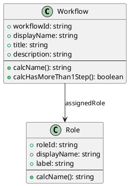

# Orchestration Layer

Test orchestration and conformance testing for the Effortless Rulebook.

## Overview

The orchestration layer coordinates testing across all execution substrates. It ensures that every substrate computes the same results from the same rulebook.

## Key Components

| File | Purpose |
|------|---------|
| `orchestrate.sh` | Main menu-driven orchestration script |
| `test-orchestrator.py` | Python script that runs tests and grades results |
| `all-tests-results.md` | Summary report of all substrate test results |

## Technology

The orchestration system uses:
- **Bash**: Shell scripts for menu navigation and subprocess coordination
- **Python**: Test orchestration logic, JSON comparison, and reporting
- **JSON**: Test artifacts (answer-key.json, blank-test.json, test-answers.json)

## ERB Architecture Example (PlantUML):



## Running the Orchestrator

```bash
cd orchestration
./orchestrate.sh
```

Select option **6** to run all substrates and see the conformance report.

## Source

Generated from: `effortless-rulebook/effortless-rulebook.json`
