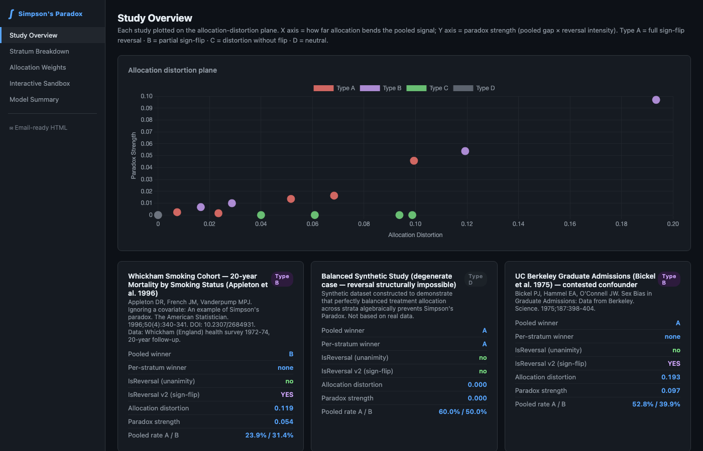
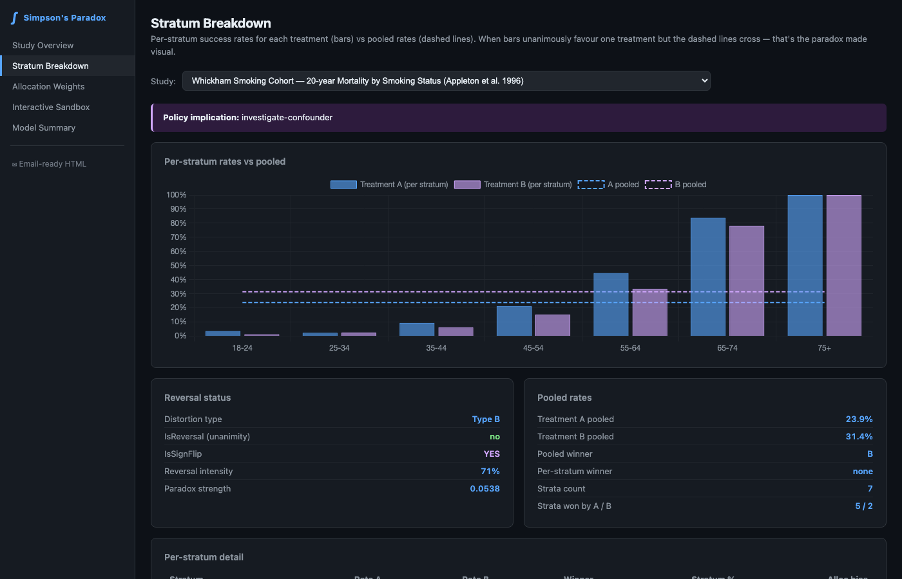
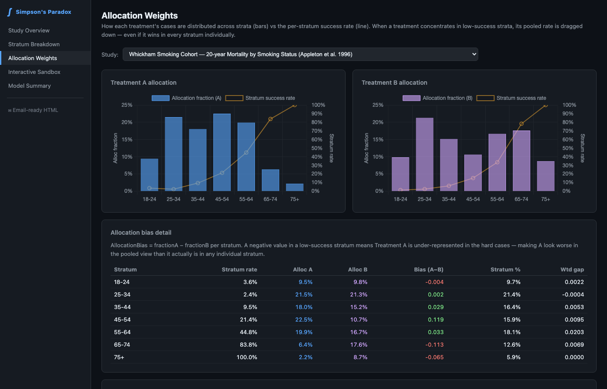
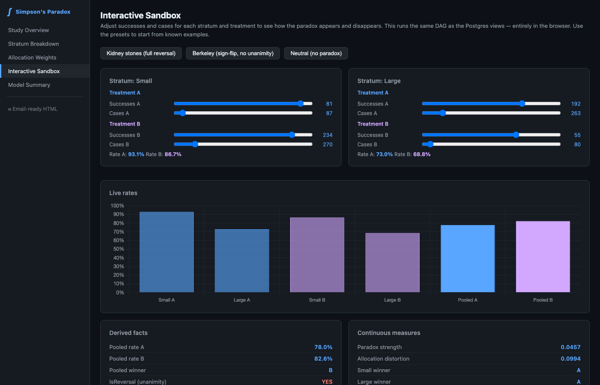
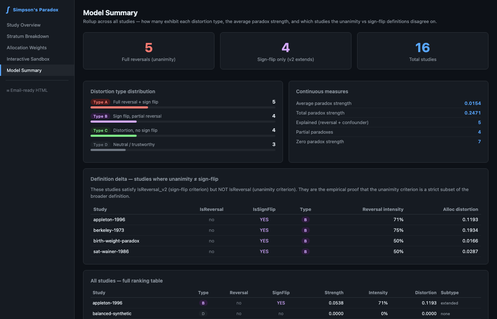

# Simpson's Paradox — Witnessed DAG Demo

A **witnessed dependency graph** that turns Simpson's paradox from a textbook curiosity into a computational object. Sixteen published and synthetic studies — spanning medicine, law, sports, public health, and education — are poured into a single entity model. Every derived value falls out of formulas declared in the rulebook. No inference is ever hand-entered.

---

## What this is

An **Effortless Rulebook (ERB)** domain. The SSoT is `effortless-rulebook/simpsons-paradox-rulebook.json`. All other artifacts — Postgres SQL, views, the explorer UI — are mechanically derived from it.

The paradox **emerges** from the model. It is not modeled directly. `IsReversal` is a derived boolean that falls out of comparing pooled rates to per-stratum rates. There is no `ReversalDetection` entity.

---

## The entity model

```
Studies ──< Strata ──< CaseCells            ← raw leaves: (successes, cases) per cell
   └──< Treatments
              │
              └──> StratumSummaries          per-(stratum, treatment) rates, StratumGap,
                                             AllocationBias, WeightedStratumRate
              └──> TreatmentRankings         IsReversal, IsSignFlip, AllocationDistortion,
                                             DistortionType, PolicyImplication,
                                             CorrectedWinner, CorrectedPolicyImplication
   └──< StratumVariables                     IsConfounder, CausalRole, AdjustmentAppropriate
   └──  ModelSummary                         epistemic rollup across all 16 studies
   └──  InstrumentSpec                       5 input fields, 10 derived coordinates,
                                             machine-verifiable adapter contract
   └──  InvariantChecks                      7 algebraic self-consistency assertions (all PASS)
```

`CaseCells` is the ground truth. The Postgres view chain is:
`vw_case_cells` → `vw_stratum_summaries` → `vw_treatment_rankings` → `vw_model_summary`.

---

## The four distortion types

Beyond the binary `IsReversal`, every study is classified on a continuous distortion plane (allocation bias × paradox strength):

| Type | Criterion | Studies |
|---|---|---|
| **A — Full reversal** | `IsSignFlip=true`, unanimity across all strata | kidney-1986, reintjes-2000, radelet-1981, jeter-justice-1997, phe-covid-2021 |
| **B — Sign flip** | `IsSignFlip=true`, not unanimous | berkeley-1973, appleton-1996, birth-weight-paradox, sat-wainer-1986 |
| **C — Compressed** | `IsSignFlip=false`, `AllocationDistortion>0.01` | compressed-synthetic, hannan-1994, titanic-1912, melanoma-altman-1991 |
| **D — Neutral** | `AllocationDistortion<0.01` | balanced-synthetic, kidney-balanced, coffee-tverdal-2020 |

`AllocationDistortion = |WeightedStratumGapSum − SignedPooledGap|` — the scalar distance between what equal-weight strata would show and what the actual allocation-weighted pooled number shows. Berkeley scores 0.193 (nearly twice kidney-1986's 0.099), despite `IsReversal=false`.

---

## The 16 studies

| Study | N | Type | Domain | Source |
|---|---|---|---|---|
| kidney-1986 | 700 | A | medicine | Charig et al., BMJ 1986 |
| reintjes-2000 | 3,519 | A | hospital epidemiology | Reintjes et al., Epidemiology 2000 |
| radelet-1981 | 326 | A | criminal justice | Radelet, Am Soc Rev 1981 |
| jeter-justice-1997 | 2,330 | A | sports | Ross, College Math J 2007 |
| phe-covid-2021 | 268,166 | A | public health | PHE Technical Briefing 20, 2021 |
| berkeley-1973 | 3,228 | B | education | Bickel et al., Science 1975 |
| appleton-1996 | 1,314 | B | epidemiology | Appleton et al., Am Statistician 1996 |
| birth-weight-paradox | 7,500 | B | neonatology | Yerushalmy 1971 / Hernandez-Diaz 2006 |
| sat-wainer-1986 | 1,150 | B | education | Wainer 1986 |
| compressed-synthetic | 400 | C | synthetic | constructed |
| hannan-1994 | 1,100 | C | surgery | Hannan et al., JAMA 1994 |
| titanic-1912 | 946 | C | history | British Board of Trade 1912 |
| melanoma-altman-1991 | 400 | C | oncology | Altman 1991 / Balch 2001 |
| balanced-synthetic | 400 | D | synthetic | constructed |
| kidney-balanced | 700 | D | counterfactual | derived from kidney-1986 |
| coffee-tverdal-2020 | 4,000 | D | cardiology | Tverdal et al., Eur J Prev Cardiol 2020 |

Synthetic and counterfactual studies are structural controls — they prove impossibility claims (balanced allocation → reversal structurally impossible) and isolate single causal factors.

---

## What the model witnesses

All seven algebraic invariants pass across all 16 studies (7/7 PASS, 0 failures):

- Every row has a `DistortionType` in {A,B,C,D}
- Types A and B always have `IsSignFlip=TRUE`
- Types C and D always have `IsSignFlip=FALSE`
- When `IsSignFlip=TRUE`, corrected and pooled winners always disagree
- When `DistortionType=D`, corrected and pooled winners always agree
- Type-D rows always have `AllocationDistortion < 0.01`
- `SIGN(CorrectedGap) = SIGN(WeightedStratumGapSum)` for all rows

The model also witnesses its own epistemic coverage in a single `ModelSummary` row: 5 full reversals (unanimity), 9 sign-flips (v2 criterion), all four distortion types populated, `AllocationDistortion` measured for all 16 studies.

**Reversal recovery is free.** `CorrectedGap = WeightedStratumGapSum` is already derived from the allocation arithmetic. The allocation-corrected winner (`CorrectedWinner`) and its policy implication (`CorrectedPolicyImplication`) cost zero new data.

---

## Explorer UI

Run `./start.sh` to boot the backend (`:3001`) and Vite frontend (`:5173`).

### Study Overview

The allocation-distortion plane. X = how far allocation bends the pooled signal; Y = paradox strength. Each dot is a study, colored by type.



### Stratum Breakdown

Per-stratum success rates (bars) vs pooled rates (dashed lines) for any selected study. When bars unanimously favour one treatment but the dashed lines cross — that's the paradox made visual.



### Allocation Weights

How each treatment's cases are distributed across strata (bars) vs the stratum success rate (line). When a treatment concentrates in low-success strata, its pooled rate is dragged down even when it wins every stratum individually.



### Interactive Sandbox

Adjust raw counts via sliders. `IsReversal`, `IsSignFlip`, `AllocationDistortion`, and `DistortionType` update live — running the same DAG as the Postgres views, entirely in the browser. Presets load kidney-1986, Berkeley, and the neutral control.



### Model Summary

Rollup across all 16 studies: distortion type distribution, average paradox strength, and the "definition delta" table showing which studies the unanimity vs sign-flip definitions disagree on.



---

## What this is not

The instrument is **geometric**: it classifies allocation distortion and flags the allocation-corrected winner from arithmetic alone. Whether it is safe to act on that correction as a causal claim is answered by `AdjustmentAppropriate`, which gates on `ConditioningRisk` and `CausalClaimStatus`. Berkeley is the proof: it has the highest `AllocationDistortion` (0.193) but `CausalRole=contested` — the instrument classifies the geometry; the researcher supplies the causal account.

---

## Build discipline

```bash
git status                               # always check first
cd effortless-postgres && ./init-db.sh   # drop and recreate from rulebook
```

No migrations. Edit rulebook → build → DB reflects it.

---

## Local transpiler bus (`localhost:4242`)

> **All 13 local transpilers live on `localhost:4242`.** Once you run
> `./start.sh` from the repo root, the ssotme-proxy exposes every repo-local
> transpiler — `rulebook-to-postgres`, `rulebook-to-python`, `rulebook-to-golang`,
> `rulebook-to-cobol`, `rulebook-to-owl`, and more — as first-class `ssotme://`
> routes any `effortless build` can call.
