# NTWF Feature To-Do — make each gap a toggleable thing in the Console UI

Derived from [FEATURE-COVERAGE.md](FEATURE-COVERAGE.md). Every item below is a feature
that the rulebook **already computes** but the **Release Console** does not yet
*demonstrate*. The job is never "compute it" (Postgres/OWL already did — read the view).
The job is "give the user a control they can flip and watch the substrate's answer change."

## The UI idiom these must fit

The Console (`app/frontend/src/App.tsx`) is already a **toggle machine**:

- **Lenses** = tabs in the `viewbar`, driven by the URL `/console/:view`. Today: `flow`,
  `graph`, `closure` (the `VIEWS` array in [App.tsx](app/frontend/src/App.tsx#L31)). A new
  *view* of the model is a new entry in `VIEWS` + a `<XView sit=… handlers=… />` in the
  `stage` switch.
- **Overlays** = a labeled control (pill, switch, slider) that re-filters or annotates the
  *current* board without leaving the lens (e.g. the draggable `StalenessBar`,
  `TimeBudgetBar`). A new *annotation* of the existing board is an overlay, not a tab.
- **Edits** = anything dotted is editable in place; `mutate()` writes a raw fact, the
  substrate recomputes, the board reloads with the `✦ reasoning…` veil. A new *interactive*
  demo reuses `handlers` / `api.patchRow|addRow|deleteRow`.

**Rule for every item: the toggle flips a raw fact or a display mode — it NEVER computes the
answer.** Read the already-computed column from the story payload (`vw_<entity>` → API). If a
field isn't in the payload yet, the fix is to add it to the API projection, not to derive it
in React.

**Definition of "toggleable & clear" (acceptance bar for each item):**
1. A visible, labeled control (tab, switch, slider, or pill) — a user can find it without docs.
2. Off ↔ on (or A ↔ B) visibly changes the board, and the change is *legible* ("now showing
   inferred edges", "as of 2026-03-01", "Postgres vs reasoner").
3. The value shown is read straight from the substrate's computed column — no React-side math.
4. Where it's an *edit*, flipping it round-trips through `mutate()` and the veil fires.

Ordered by pedagogical value (matches the FEATURE-COVERAGE gap list 1–14).

> **Mockups.** Each feature below has a wireframe PNG in
> [docs/feature-mockups/](docs/feature-mockups/), drawn in the Console's real dark
> palette (topbar, lens tabs, the `✦ reasoning…` veil, the type hues). They are
> *concept art for the toggle*, not pixel-final UI. Regenerate them with
> `node docs/feature-mockups/gen-mockups.mjs && (cd docs/feature-mockups && for f in *.svg; do rsvg-convert -z 2 "$f" -o "${f%.svg}.png"; done)`.

---

## 1. Competency-Question scoreboard (CQ1–CQ8) — `🟡→✅`

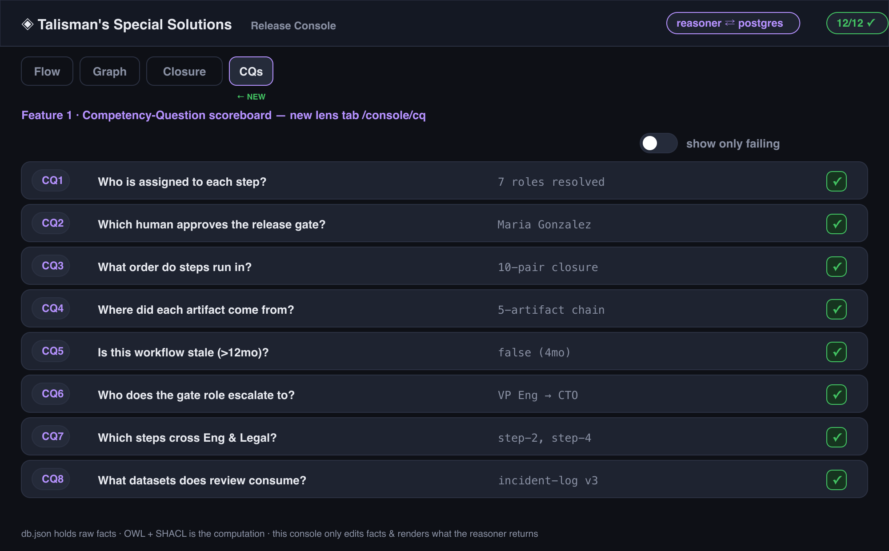

*Covers II-5, III-Suite-3.* The single highest-value gap: the article's literal acceptance suite.

- **Toggle shape:** a new **lens tab** `cq` (`/console/cq`) — add `{ id: "cq", label: "CQs",
  hint: "the 8 leadership questions, answered live" }` to `VIEWS`.
- **What flips:** each CQ row is a card showing the question, its live answer, and ✓/✗. The
  "toggle" per row is a disclosure that expands to the backing field(s) and links into `/dag`
  for the derivation. A header switch **"show only failing"** filters the list.
- **Wiring:** answers come straight from computed columns already in the payload (e.g. CQ5 =
  `Workflows.IsStale`, CQ2 = the gate's `GateApproverHuman`). One CQ→field map in a small
  `cqs.ts`; render answers, never recompute them.
- **Why it earns a tab:** it's a distinct *view of the model* (the contract), not an
  annotation of the flow board.

## 2. Provenance / artifact-lineage lens — `🟦→✅`

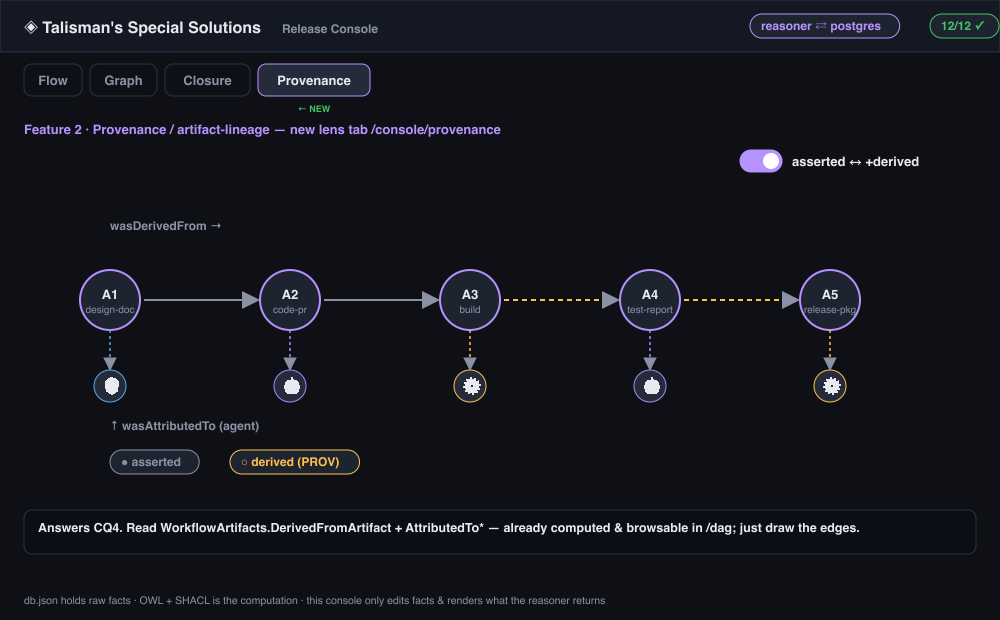

*Covers III WorkflowArtifact, producesArtifact, wasDerivedFrom, wasAttributedTo; answers CQ4.*

- **Toggle shape:** new **lens tab** `provenance` (`/console/provenance`).
- **What flips:** draws the 5-artifact `wasDerivedFrom` chain as a DAG; each artifact node
  links to its `wasAttributedTo` agent (🧑/🤖/⚙️ icon). A header switch **"asserted only ↔
  +derived"** mirrors the Closure lens's asserted/inferred idiom.
- **Wiring:** `WorkflowArtifacts.DerivedFromArtifact` + `AttributedTo{Human,AI,Pipeline}` are
  already computed and browsable in `/dag`; project them into the story and draw edges. Reuse
  GraphView's node/edge renderer if practical.

## 3. Delegation / escalation view — `🟦→✅`

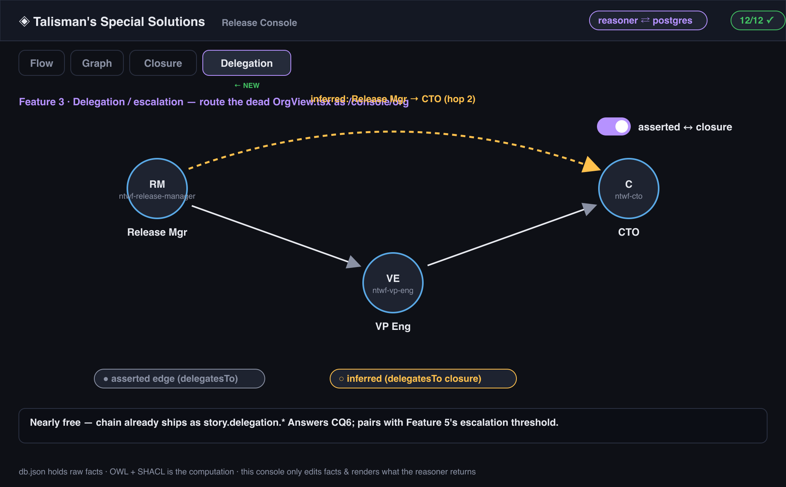

*Covers III delegatesTo; answers CQ6; pairs with item 5's escalation threshold.*

- **Toggle shape:** **route the dead `OrgView.tsx`** — it already exists and is unrouted. Add
  `{ id: "org", label: "Delegation", hint: "escalation chain · asserted vs inferred" }` to
  `VIEWS` and `view === "org" && <OrgView … />` to the stage switch.
- **What flips:** shows Release Mgr → VP Eng → CTO. A switch **"asserted ↔ closure"** toggles
  the `DelegationClosure` inferred hops (each tagged `is_inferred`/`hop_distance`), same
  asserted-●/inferred-○ visual language as step-precedence closure.
- **Wiring:** the chain is already computed *and shipped* to the frontend as
  `story.delegation`; nothing new to compute — just render the already-delivered data and
  add the asserted/inferred toggle.

## 4. "Blast radius" / AI-system-registry panel — `🟦→✅`

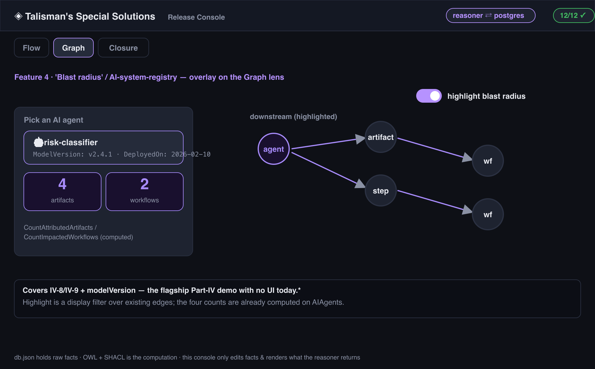

*Covers IV-8, IV-9, modelVersion.*

- **Toggle shape:** an **overlay panel** opened from a 🤖 AI-agent chip (like the reassign
  popover), OR a sub-mode of the Graph lens toggled by a **"highlight blast radius"** switch.
- **What flips:** pick an AI agent → the board highlights the artifacts/steps/workflows it
  touches and shows `CountAttributedArtifacts` + `CountImpactedWorkflows` + `ModelVersion` /
  `DeployedOn`. Toggling between agents re-highlights.
- **Wiring:** all four numbers are already computed on `AIAgents`; surface them in the payload
  and read them. The highlight is a display filter over existing edges — no recomputation.

## 5. Approval-gate detail — `🟡→✅`

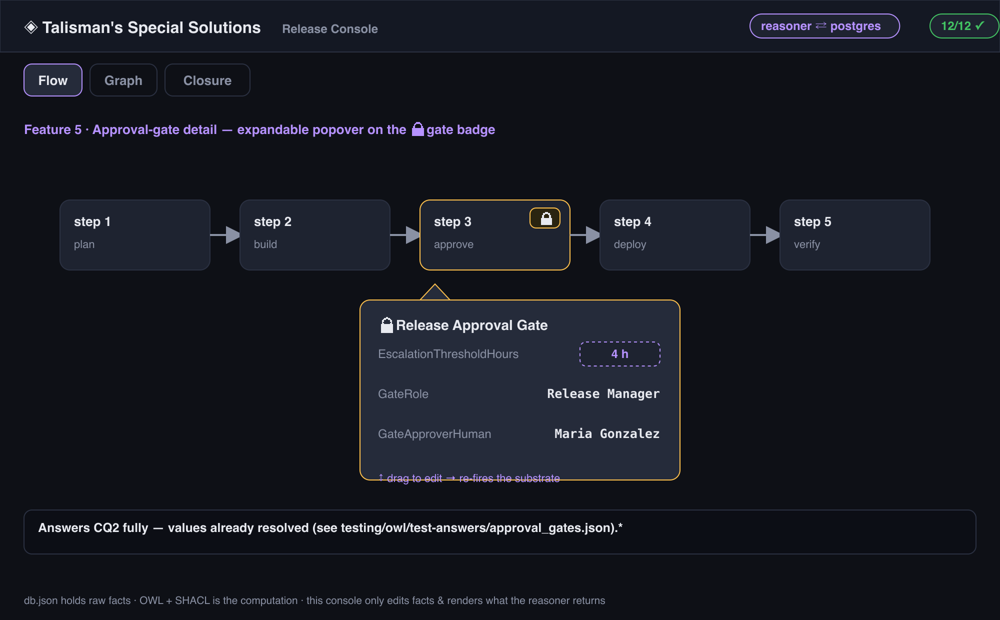

*Covers III ApprovalGate properties; answers CQ2 fully. (Today the gate is just a 🔒 badge.)*

- **Toggle shape:** an **expandable popover/panel** on the 🔒 gate badge (click to open),
  reusing the in-place-edit popover pattern.
- **What flips:** reveals `EscalationThresholdHours`, `GateRole`, `GateApproverHuman` (already
  resolved — see `testing/owl/test-answers/approval_gates.json`: `gate_role` =
  `ntwf-release-manager-role`, `gate_approver_human` = `ntwf-maria-gonzalez`). Make
  `EscalationThresholdHours` a **draggable/editable number** so changing it re-fires the
  substrate — and it becomes the natural hand-off into item 3's delegation chain.
- **Wiring:** read the resolved lookups from the gate row; the edit round-trips via
  `api.patchRow("ApprovalGates", …)` through `mutate()`.

## 6. Bitemporal "as-of date" time-travel — `🟦→✅`

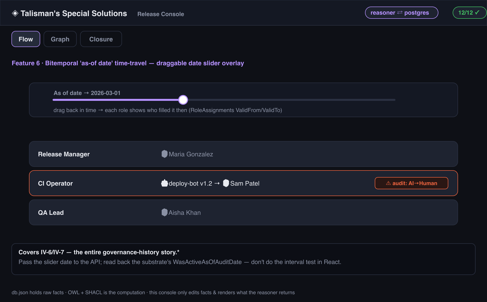

*Covers IV-6, IV-7 — the whole governance-history story.*

- **Toggle shape:** a **draggable date slider** overlay (a sibling of `StalenessBar`), labeled
  "As of …", spanning the RoleAssignments validity range.
- **What flips:** dragging the date re-filters which `RoleAssignments` row is active
  (`ValidFrom`/`ValidTo`), so each role shows *who filled it then*. Rows where
  `IsAgentTypeChange`/`RequiresComplianceAudit` are true get a ⚠ flag. The default position is
  "now"; dragging back in time is the demo.
- **Wiring:** `WasActiveAsOfAuditDate` etc. are computed *per audit date* — the cleanest path
  is to pass the slider's date to the API and read back the substrate's as-of answer (don't
  do the interval test in React). Reuse `useDraggable`.

## 7. Inject-an-error / consistency lab (Suite 4) — `❌→✅`

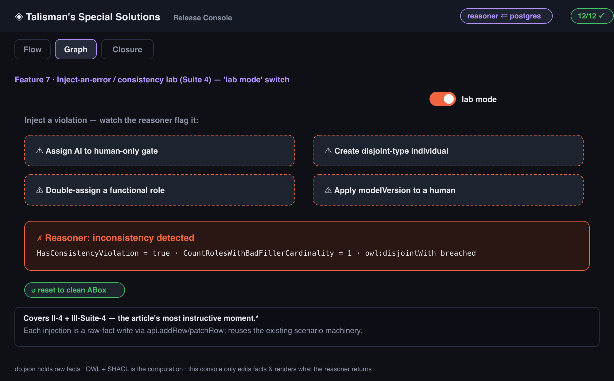

*Covers II-4, III-Suite-4. The article's most instructive moment.*

- **Toggle shape:** a **"lab mode" switch** in the topbar that surfaces deliberately-breaking
  actions, plus a few one-click **"inject error" buttons** (each a scenario-style fact write).
- **What flips:** offered violations — (a) assign an AI to a human-only gate (already partly
  demoable), (b) create a disjoint-type individual, (c) double-`assignedRole`
  (functional-property `sameAs` collapse), (d) apply `modelVersion` to a human (domain
  mis-inference). After each, the board shows the reasoner's flag
  (`HasConsistencyViolation` / `CountRolesWithBadFillerCardinality`). A **"reset"** restores
  the clean ABox.
- **Wiring:** each injection is a raw-fact write via `api.addRow`/`patchRow`; the violation
  booleans already exist. This reuses the existing scenario machinery (`api.applyScenario`).

## 8. Dataset (DCAT) surface — `🟦→✅`

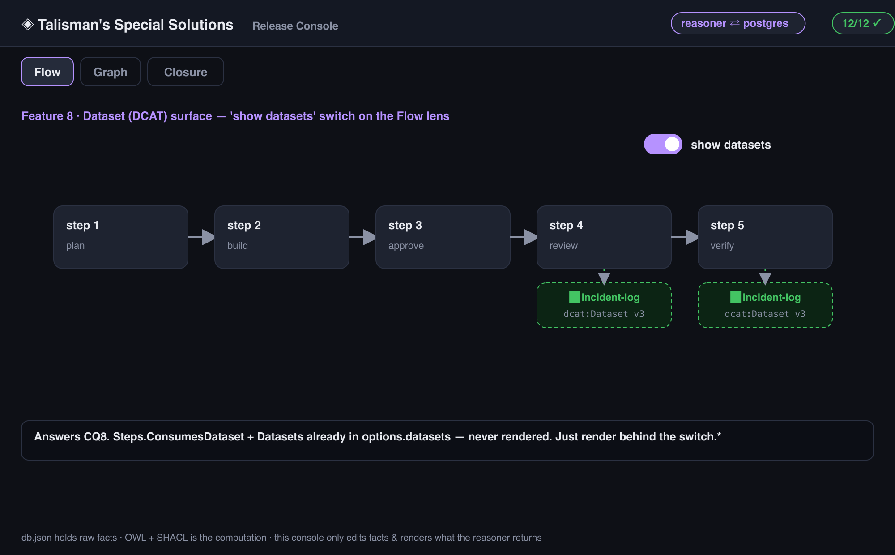

*Covers III consumesDataset; answers CQ8.*

- **Toggle shape:** an **overlay annotation** on the Flow lens — a **"show datasets" switch**
  that draws a dataset chip on each step that `consumesDataset`, with the distribution URL.
- **What flips:** off = today's board; on = each consuming step shows its `dcat:Dataset` link.
- **Wiring:** `Steps.ConsumesDataset` + the `Datasets` table are in `options.datasets` but
  never rendered — just render them behind the switch.

## 9. SKOS vocabulary surfaces — `🟡/🟦→✅`

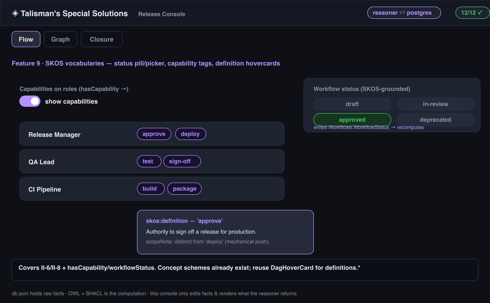

*Covers II-6, II-8, III hasCapability/workflowStatus.*

- **Toggle shape:** three small toggles, each a clear control:
  - `workflowStatus` as a **grounded status pill/picker** in the VerdictHeader (pick a
    `WorkflowStatusConcepts` value → writes the fact → substrate recomputes). This is a
    *real edit toggle*, distinct from the compliance verdict.
  - `hasCapability` **tags shown on roles** behind a "show capabilities" switch.
  - concept `Definition`/`ScopeNote` as **hovercards** (reuse `DagHoverCard`) on status pills
    and capability tags.
- **Wiring:** `WorkflowStatusConcepts` / `AgentCapabilityConcepts` already exist; the picker
  writes `Workflows.WorkflowStatus`; definitions render from the concept rows.

## 10. Department / cross-cutting view — `🟦→✅`

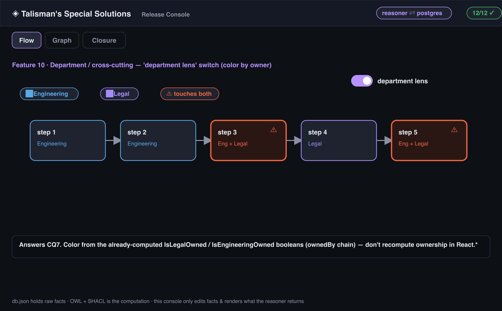

*Covers III Department, ownedBy; answers CQ7.*

- **Toggle shape:** a **"department lens" switch** (or a sub-toggle inside item 3's Org lens)
  that recolors each step by owning department and flags steps touching **both** Engineering
  and Legal.
- **What flips:** off = normal coloring; on = department coloring + a "touches Eng & Legal"
  highlight.
- **Wiring:** `IsLegalOwned` / `IsEngineeringOwned` are already computed per step via the
  `ownedBy` chain — color from those booleans, don't recompute ownership in React.

## 11. Governance panel — `🟦→✅`

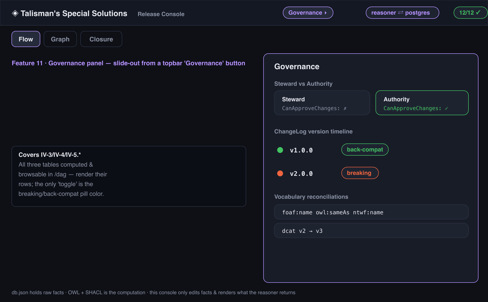

*Covers IV-3, IV-4, IV-5.*

- **Toggle shape:** a **slide-out panel** toggled from a topbar "Governance" button (not a main
  lens — it's reference, not a board).
- **What flips:** open shows three sections — Steward vs Authority (`GovernanceRoles`,
  `CanApproveChanges`); the **ChangeLog version timeline** with a per-event toggle pill
  **breaking ↔ back-compat** (`IsBreakingChange`/`IsBackwardCompatible`); and the
  `VocabularyReconciliations` rows.
- **Wiring:** all three tables are computed & browsable in `/dag`; render their rows. The only
  "toggle" semantics are the breaking/back-compat pill colors driven by the computed booleans.

## 12. Standards-provenance overlay — `❌→✅`

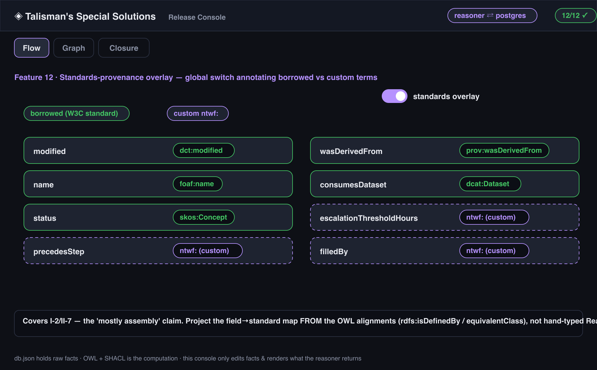

*Covers I-2, II-7 — the "mostly assembly" claim.*

- **Toggle shape:** a global **"standards overlay" switch** in the topbar that, when on,
  annotates every field/column with the external term it maps to (`prov:wasDerivedFrom`,
  `foaf:name`, `dcat:Dataset`, …) vs custom `ntwf:`, color-coded borrowed vs invented.
- **What flips:** off = plain labels; on = each label carries a small provenance badge +
  hovercard naming the standard.
- **Wiring:** the alignments live in the OWL substrate (`owl:equivalentClass`/`subClassOf`,
  `rdfs:isDefinedBy`). Surface a field→standard map (ideally read from the OWL alignments, not
  hand-typed) and render badges. **Do not hardcode the mapping in React if it can be projected
  from the substrate** — that's the SSoT discipline.

## 13. Type-inference expansion — `🟡→✅`

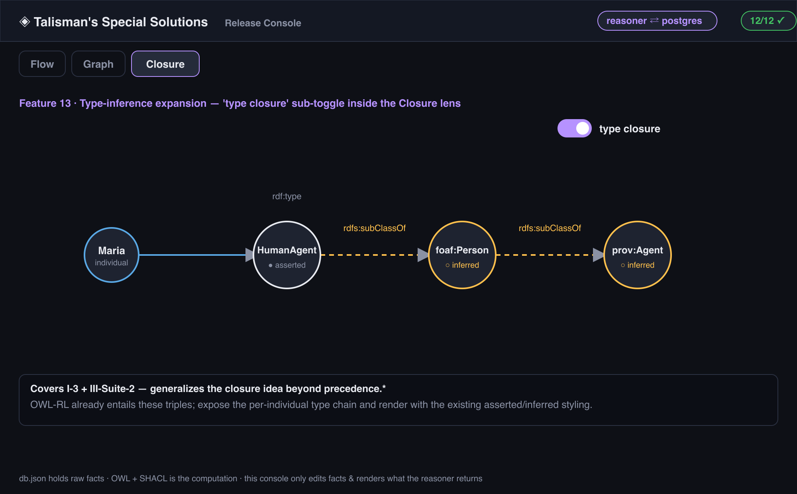

*Covers I-3, III-Suite-2. Generalizes the closure idea beyond precedence.*

- **Toggle shape:** inside the Closure lens, a **"type closure" sub-toggle** (alongside the
  existing precedence closure) — or click any individual to expand its type chain.
- **What flips:** asserted type → entailed supertypes
  (HumanAgent → foaf:Person → prov:Agent), each tagged asserted ● / inferred ○ exactly like
  the precedence closure.
- **Wiring:** the OWL-RL closure already entails these triples; expose the per-individual type
  chain from the reasoner output and render with the existing asserted/inferred styling.

## 14. ModelVersion / DeployedOn on AI agents — `❌→✅`

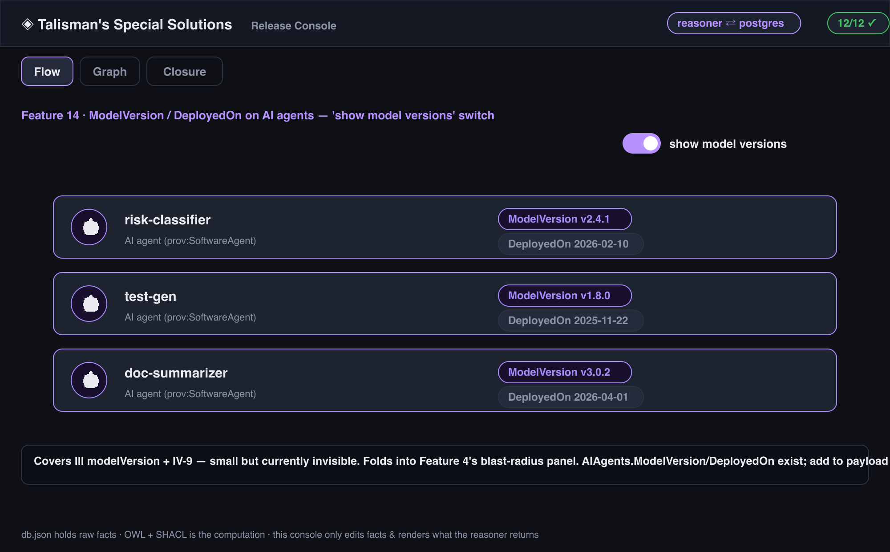

*Covers III modelVersion, IV-9. Small but currently invisible.*

- **Toggle shape:** the simplest — a **"show model versions" switch** that reveals
  `ModelVersion` / `DeployedOn` chips on each 🤖 AI agent (in the reassign popover and on the
  board). Folds naturally into item 4's blast-radius panel.
- **What flips:** off = today; on = audit-version chips on every AI agent.
- **Wiring:** `AIAgents.ModelVersion` / `DeployedOn` exist; add to the payload and render.

---

## Build sequence (suggested)

`1 → 5 → 6` close the three highest-value distinct surfaces (CQ scoreboard, the gate detail
that bridges into delegation, and the bitemporal slider). `2 → 3` add the two un-drawn DAGs
(provenance, delegation — and item 3 is *nearly free* since `OrgView.tsx` exists and the data
already ships). `4 → 7` deliver the two flagship Part-IV "watch it react" demos (blast radius,
consistency lab). `8 → 14` are smaller overlays/switches that round out DCAT, SKOS, governance,
standards-provenance, and the type-closure generalization.

**Reminder on every line of every one of these:** the control flips a fact or a display mode;
the *answer* comes from `vw_<entity>` / the reasoner. If you find yourself writing
`rows.filter(...)`, an `INDEX/MATCH` resolver, or "effective value" logic in React, stop — the
view already has the column. The view is the contract.
