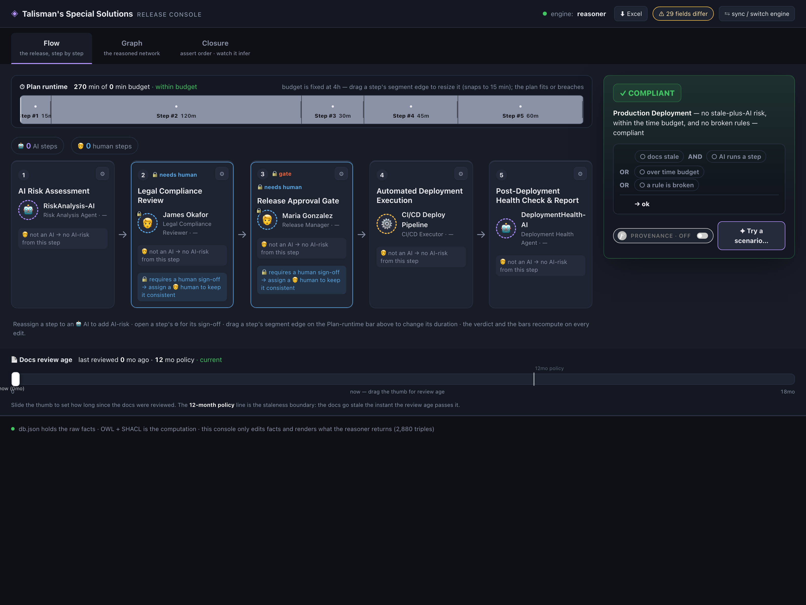
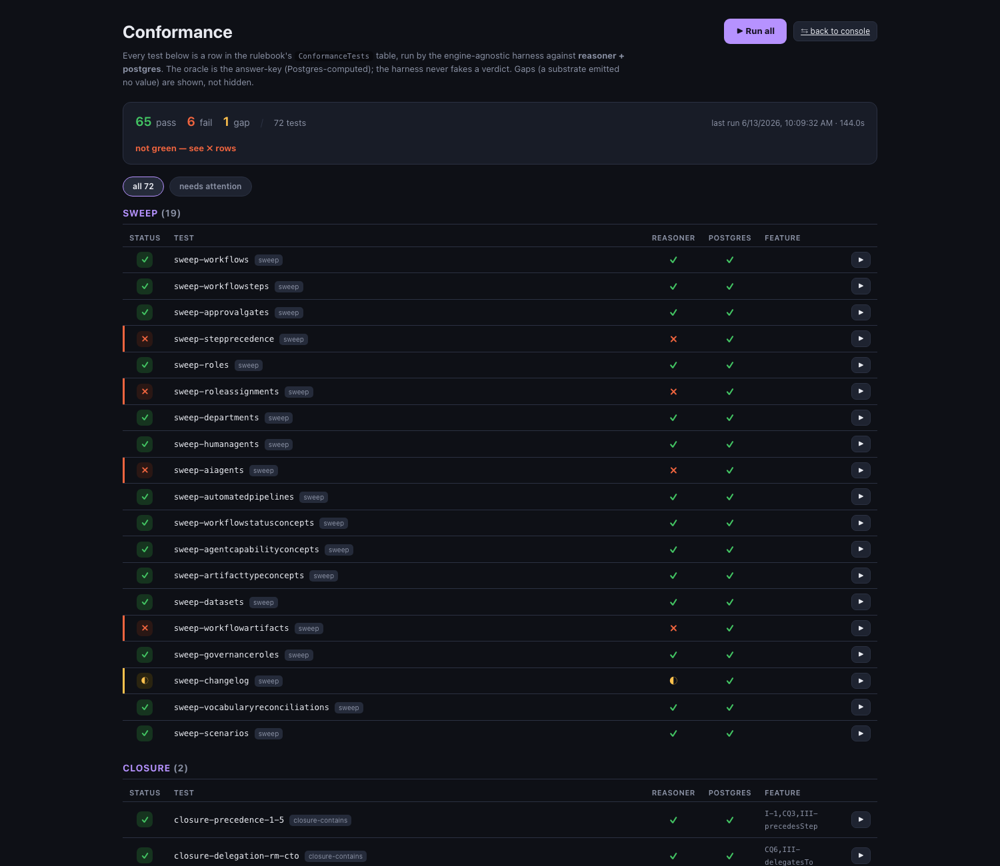
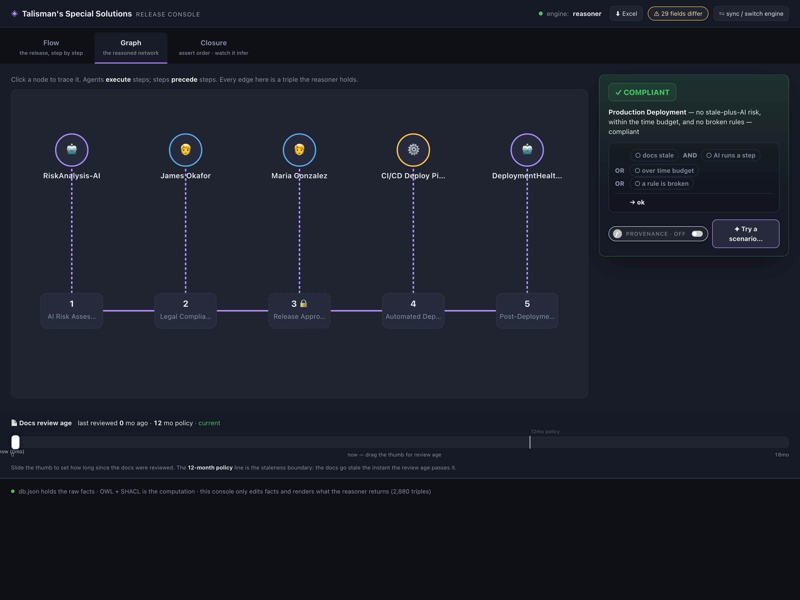
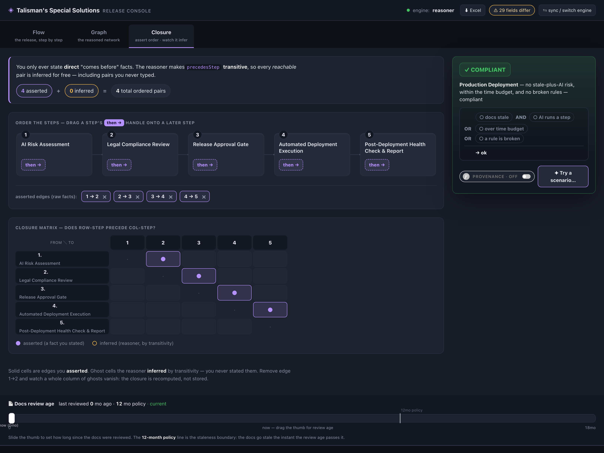

# Talisman's Special Solutions — A Rulebook-First Workflow Ontology

**A worked example -** *inspired by Jessica Talisman and her fantastic [4 Part Ontology series](https://jessicatalisman.substack.com/p/ontology?utm_source=publication-search) -* **showing how one semantic rulebook can generate an ontology, a database, executable logic, documentation, tests, and multiple runtime projections from the same source of meaning.**

This project models the workflow ontology from Jessica Talisman’s *Intentional Arrangement* ontology series, using the fictional **Talisman's Special Solutions** workflow domain: human specialists, AI agents, automated pipelines, approval gates, provenance, datasets, escalation paths, and compliance review.



*The Release Console (Flow lens). The five ordered steps run left to right; each card shows its role, the agent filling it, and human/AI/pipeline type. The panel on the right is the live **compliance verdict** — every value on screen is read from the substrate's computed columns, not recomputed in the UI.*

---

## If you read only this screen

**Everything the ontology series teaches about *modeling* — competency questions, disjoint
classes, role–filler separation, reusing PROV-O / DCAT / SKOS, the TBox / ABox / CBox discipline —
is load-bearing here and required in full. None of that skill is retired.** This repo removes
exactly one thing: the assembler-like work of hand-stitching that model across OWL + RDF + SHACL +
SPARQL to make it *run*. You author the meaning once, one layer up, and OWL, Postgres, Python, Go,
Excel, English prose, and the conformance tests are generated **siblings**.

It is not a different approach to modeling. It is a **superset**: the same modeling, minus the
assembly.

### The receipt

One source — `effortless-rulebook/talismans-special-solutions-rulebook.json`, the full NTWF worked
example (role–agent separation, approval-gate subtype, transitive step-precedence closure,
delegation chain, PROV provenance, DCAT datasets, SKOS vocabularies, a derived compliance verdict).
Every projection generated from it is scored **row-by-row and column-by-column** against a
**Postgres-oracle answer key**, and the suite is re-run on every change.

The score on any given day is a moving target — entities get added, formulas get sharpened, the
model grows. What is *not* a moving target is the **shape of the effect** you watch repeat every
time the ontology evolves:

- **Add a concept, change a rule, grow the model** in the one rulebook, and the **Postgres
  projection tracks it** — the new column, the new closure edge, the new derived verdict simply
  appear, correct, in the views.
- A **less-mature transpiler lags, then catches up** — each growth spurt can open a fresh gap in
  whichever substrate's generator hasn't implemented that feature yet (a closure that hasn't been
  re-stitched, a lookup the SHACL shapes don't yet cover) that then gets assembled back into parity.
  The deltas are always in the **assembly**, never in the **meaning**.

That the projections must **agree** — and that the suite flags the instant one diverges — is the
receipt: agreement is the proof they are one object; divergence is the alarm. A lag never means a
substrate is "more real," only that its transpiler is less mature for that feature. Postgres is the
answer-key oracle because, for these closed-world formulas, its transpiler currently has no gaps — so
the delta shows up on whichever *graded* substrate is least mature for a feature; today that is
usually OWL, but Excel, Go, or Python can lag just as easily on something theirs doesn't yet emit.
**The cost was never in the modeling. It is in the assembly — and the assembly is the part this repo
lifts off the author.** (Today's exact tally lives
in `testing/conformance-runs/latest.json`; run `./start.sh` and watch it move as you edit the
rulebook.)



*The receipt, on screen: every row in the rulebook's `ConformanceTests` table, run by the
engine-agnostic harness against the Postgres-oracle answer key. Green where the reasoner and
Postgres agree; the ✗ rows are exactly the open-world **assembly** gaps described above — surfaced,
never hidden.*

### The standing bet

This repo makes a falsifiable claim and invites attack on it:

> Produce one competency question — finite, design-time — that the OWL / RDF / SHACL stack can
> answer but the rulebook **cannot** express one layer up.

The eight competency questions this example must answer are listed [below](#competency-questions-covered);
each resolves from the generated substrates, and the conformance suite is the referee. If you find
one that genuinely needs open-world machinery and can't be captured in the rulebook, that is not a
loss for the project — **that is exactly the finding the project is looking for.**

*Everything below is the careful, long-form version: what this is, what it is **not** saying, and
how to read the repo from ontology, database, MDE, or application backgrounds. The screen above is
the whole claim; the rest is the evidence and the reassurance.*

---

## Important DevOps Note: the toolchain is a *compiler*, not a deployment

The list of `*.cpln.app` URLs and the `localhost:4242` bus in `effortless.json` can look like heavy,
fragile infrastructure. They are **not the runtime.** They are the **compiler toolchain**, and the
running app uses *none* of them.

- **The hosted transpilers are code generators** — think of them as the dynamic equivalent of an
  `npm` / `pip` / `nuget` package. The one difference: a normal package ships fixed bytes, whereas a
  transpiler's output depends on its **input** (your rulebook). So instead of installing a static
  dependency, you call a hosted generator that turns *your* rulebook into SQL, OWL/SHACL, a React
  DAG, etc. You only invoke them when you **regenerate** substrates after editing the rulebook.
- **`localhost:4242` is just a local bus** that lets the `effortless` CLI reach the repo-local
  transpilers. It boots on demand at build time and is irrelevant at runtime.
- **Most transpilers are open source, right in this repo.** A couple (Postgres among them) are
  licensed hosted tools. Either way their *output* — the committed SQL, OWL/SHACL, and React DAG — is
  checked in, so a fresh clone runs as-is.
- **The committed artifacts run with zero of this.** `./start.sh` boots an Express API, a Vite UI, a
  local Postgres, and an in-process reasoner — nothing remote, nothing version-pinned. You reach for
  the CLI and the bus **only** when you want to *rebuild* from a changed rulebook.

So the reproducibility story is not fragile, it is two clean worlds: **build-time** needs the
toolchain; **runtime** needs a clone and `./start.sh`. (The Quick Start below has the full
build-time-vs-runtime breakdown.)

---

The purpose of this repo is **not** to argue against OWL, RDF, SHACL, SPARQL, triples, or ontology engineering.

It is the opposite.

This repo starts from the ontology-engineering insight that meaning should be made explicit, formal, testable, and shared. It then asks one practical model-driven engineering question:

> What if the source of truth lives one layer above any single representation, so that OWL, RDF, SHACL, Postgres, Python, Go, Excel, English, tests, and documentation are all generated siblings?

In other words:

```text
canonical rulebook
  → OWL / RDF / SHACL
  → Postgres schema, functions, views, and seed data
  → Python / Go / other executable substrates
  → Excel-style formulas
  → English / Rulespeak documentation
  → conformance tests
```

OWL remains a first-class semantic artifact.
SHACL remains a first-class validation artifact.
RDF triples remain a first-class graph representation.
SPARQL remains a first-class query language over RDF graphs.

The only shift is this:

> In this repo, OWL is not treated as the only possible source code for meaning. It is one generated projection of a higher-order semantic rulebook.

That distinction is the whole project.

---

## Why This Exists

Ontology engineering already has a strong discipline for building meaning before implementation:

- competency questions define scope;
- TBox, ABox, and CBox separate model structure, instance data, and governance;
- RDF gives a universal graph representation;
- OWL gives formal semantic commitments and reasoning;
- SHACL gives validation;
- SPARQL gives graph query;
- existing vocabularies such as PROV-O, DCAT, Dublin Core, SKOS, FOAF, and Schema.org give reusable semantic building blocks.

This repo agrees with that.

The additional claim is practical:

> If the same domain meaning can be represented structurally before it is emitted as OWL, SQL, Python, Excel, prose, or tests, then those generated artifacts can be kept in sync mechanically.

So instead of hand-maintaining parallel versions of the same domain logic:

```text
ontology file
database schema
application code
spreadsheet formulas
documentation
test expectations
```

this project keeps the meaning in one structural rulebook and derives the rest.

---

## Quick Start (the clone is already built)

**You do not need the `effortless` CLI to run this demo.** The generated substrates are
committed to the repo — the OWL/SHACL artifacts (`owl/src/ontology.owl`,
`owl/src/rules.shacl.ttl`, `owl/src/individuals.ttl`) and the Postgres schema + closure
views (`postgres-bootstrap/*.sql`) are checked in. A fresh clone is runnable as-is:

```bash
git clone <this repo>
cd rulebook-examples/talismans-special-solutions
./start.sh            # Express API on :8088 + Vite dev UI on :5173
# open http://localhost:5173
```

`start.sh` installs the Python reasoner deps (`rdflib`/`owlrl`/`pyshacl`) on first run and
boots both processes. That is the entire runtime.

### Build-time vs. runtime (read this before judging the dependency chain)

These are two different worlds, and the demo only needs the second one to *run*:

| Concern | What it is | When it runs | Needed to run the app? |
| --- | --- | --- | --- |
| `effortless build` + the CLI | Regenerates every substrate from the rulebook | Only when you **edit the rulebook** | **No** |
| The cpln `*.cpln.app` transpiler URLs in `effortless.json` | Hosted **code generators** invoked by `effortless build` | Build only | **No** |
| The `localhost:4242` ssotme-proxy bus | Local build-time transpiler router | Build only | **No** |
| Express :8088 + Vite :5173 + local Postgres + in-process Python reasoner | The actual running application | Every request | **Yes** |

So the long list of cpln URLs and the `:4242` bus are the **compiler toolchain**, not the
deployment topology. The running app talks to a local Postgres and an in-process reasoner —
nothing remote, nothing version-pinned. You only reach for the CLI when you want to
*regenerate* the committed artifacts after changing `talismans-special-solutions-rulebook.json`.

---

## The Main Idea

Most ontology workflows look something like this:

```text
competency questions
  → ontology design
  → OWL / RDF / SHACL
  → reasoner / validator / SPARQL
  → applications
```

This project explores a sibling architecture:

```text
competency questions
  → structural rulebook
  → many generated projections
      → OWL / RDF / SHACL
      → Postgres
      → Python
      → Go
      → Excel
      → English documentation
      → tests
      → UI/API substrates
```

The ontology concepts are still present. The difference is that the structural rulebook becomes the hub.

The rulebook is not prose.
It is not code in one runtime language.
It is not a database schema.
It is not an OWL file.

It is structured domain meaning: entities, fields, relationships, lookups, formulas, aggregations, seed facts, documentation, and expected behavior.

---

## What This Is Not Saying

This repo is **not** saying:

- “OWL is unnecessary.”
- “RDF is unnecessary.”
- “SHACL is unnecessary.”
- “SPARQL is unnecessary.”
- “Triples are bad.”
- “Relational databases are better than ontologies.”
- “Postgres should replace semantic-web tooling.”
- “Ontology engineers are doing it wrong.”

This repo is saying something narrower:

> When a domain model must also become a database, an API, executable code, documentation, tests, and an ontology, it may be useful to author the meaning one layer higher and generate those representations as peers.

That means OWL/RDF/SHACL can still be exactly the right representation for ontology tooling, linked data, validation, reasoning, interoperability, and graph query.

They simply do not have to be the only place where meaning is authored.

---

## Why This May Be Useful to Ontology Engineers

An ontology engineer might ask:

> If OWL already expresses the formal semantics, why move anything higher?

The answer is not that OWL fails. The answer is that many organizations need the same meaning to live in more than one execution substrate.

For example, the same workflow rule may need to appear as:

- an OWL axiom or property declaration;
- RDF instance data;
- a SHACL rule or validation shape;
- a Postgres generated column, function, or view;
- a Python predicate;
- an Excel formula;
- a Go function;
- a UI field rule;
- a documentation sentence;
- a conformance test.

If each of those is hand-authored, semantic drift is almost guaranteed.

This repo demonstrates a different path:

> Author the meaning once as structural data, then generate each substrate and test that they agree.

---

## The UI Point

One practical consequence is that the same UI can talk to different substrates.

For example, the UI can ask:

```text
Is this workflow at compliance risk?
```

and receive the same answer from:

```text
Postgres
OWL/RDF/SHACL reasoning stack
Python
Go
Excel-style formula output
```

because all of those substrates were generated from the same rulebook.



*The Graph lens shows the same model as a network: agents on top, steps below, each edge a triple the reasoner holds. The verdict panel on the right answers "Is this workflow at compliance risk?" — the engine selector in the top bar swaps which substrate produced that answer, and it stays the same.*

Changing the rulebook changes:

- the ontology projection;
- the database projection;
- the generated functions;
- the documentation;
- the tests;
- the expected results;
- the UI/API-facing behavior.

That is the point of the example.

---

## The Example Domain

This rulebook models the **Production Deployment Workflow** from the fictional company **Talisman's Special Solutions**.

The workflow includes:

- human specialists;
- AI agents;
- automated pipelines;
- roles;
- departments;
- workflow steps;
- approval gates;
- step ordering;
- delegation and escalation;
- datasets;
- workflow artifacts;
- provenance;
- status vocabularies;
- agent capability vocabularies;
- compliance-risk verdicts.

The seed data is one curated worked example rather than disconnected tutorial rows.

---

## What This Rulebook Demonstrates

This example includes:

- **14 interconnected domain tables**
- **human, AI, and automated-pipeline agents**
- **role–agent separation**
- **approval gates modeled as workflow-step subtypes**
- **step-to-step ordering**
- **transitive closure over step precedence**
- **delegation and escalation chains**
- **PROV-style artifact provenance**
- **DCAT-style dataset consumption**
- **SKOS-style controlled vocabularies**
- **derived fields**
- **lookup fields**
- **aggregation fields**
- **boolean verdict fields**
- **generated Postgres**
- **generated OWL**
- **generated SHACL**
- **generated documentation**
- **generated tests**

The important part is not any one of those outputs.

The important part is that they are generated from the same semantic rulebook.

---

## The Production Deployment Workflow

Five ordered steps carry a release from request to post-deployment report:


| #   | Step                                  | Role                      | Filled by             | Human approval? | Executed by |
| --- | ------------------------------------- | ------------------------- | --------------------- | --------------- | ----------- |
| 1   | AI Risk Assessment                    | Risk Analysis Agent       | RiskAnalysis-AI       | No              | AI          |
| 2   | Legal Compliance Review               | Legal Compliance Reviewer | James Okafor          | Yes             | Human       |
| 3   | Release Approval Gate                 | Release Manager           | Maria Gonzalez        | Yes             | Human       |
| 4   | Automated Deployment Execution        | CI/CD Executor            | CI/CD Deploy Pipeline | No              | Pipeline    |
| 5   | Post-Deployment Health Check & Report | Deployment Health Agent   | DeploymentHealth-AI   | No              | AI          |

This is the exact worked example from the series: two AI-executed steps (1 and 5), two
human-required steps (2 and 3), one deterministic pipeline step (4), and the approval gate is the
Release-Manager-owned step — so the answer to *"who approves a production deployment?"* resolves
through gate → Release Manager → **Maria Gonzalez**.

The workflow also includes:

- step precedence: `1 → 2 → 3 → 4 → 5`;
- transitive closure: asserted edges imply all reachable ordered pairs, including `1 → 5`;
- an approval gate at step 3, filled by the Release Manager;
- role delegation from Release Manager to VP Engineering to CTO;
- a provenance chain across generated artifacts;
- a risk dataset consumed by the AI risk-assessment step;
- a compliance-risk verdict derived from multiple upstream facts.

---

## The Compliance Verdict

The worked example culminates in a derived compliance verdict:

```text
IsAtComplianceRisk =
  (workflow is stale AND workflow has an AI-executed step)
  OR workflow is over its time budget
```

That one boolean crosses several layers of meaning:

```text
workflow metadata
  → modified date / staleness

workflow structure
  → steps
  → assigned roles

accountability structure
  → roles
  → filled-by agent
  → human / AI / pipeline type

execution facts
  → step duration
  → budget comparison

verdict
  → compliance risk
```

In an OWL/RDF/SHACL projection, parts of this appear as graph facts, classes, properties, rules, validation, and inferred relationships.

In Postgres, the same meaning appears as tables, foreign keys, functions, views, recursive closure, and derived columns.

Neither representation owns the meaning. Both are projections.

---

## Source of Truth

The authoritative file is:

```text
effortless-rulebook/talismans-special-solutions-rulebook.json
```

Everything else is generated.

That includes:

```text
postgres-bootstrap/
owl/
testing/
documentation outputs
runtime-specific projections
```

The intended editing model is:

```text
edit the rulebook
  → rebuild
  → regenerate all substrates
  → run conformance tests
```

Do not hand-edit generated outputs and treat them as canonical. They are intentionally downstream.

### The rulebook is the authority — the Postgres → rulebook push-back is OFF by default

The build pipeline *can* run a reverse transpiler — `postgres-calculated-to-rulebook` — that
reads the calculated/derived columns back out of Postgres and writes them into the rulebook JSON.
That route is **intentionally disabled** (`"IsDisabled": true`) in `effortless.json`.

It is off on purpose. The flow is strictly one-directional by design:

```text
rulebook (AUTHORITY)  ──build──▶  Postgres + every other substrate  (derived)
```

Postgres is a *consumer* of the rulebook, not a source for it. The dev database is dropped and
reseeded from the rulebook on every build (mock data, by design), so anything Postgres "computes"
is just the rulebook's own formulas re-evaluated against that mock seed. If the push-back ran on a
routine `effortless build`, that throwaway test data would be written **back over** the
human-authored source of truth — silently overwriting the authority with downstream output. Leaving
it disabled keeps the rulebook the one and only thing you edit by hand.

If you ever genuinely need to lift Postgres-computed values into the rulebook (e.g. to materialize
an answer key), enable that transpiler explicitly for that one build, confirm the diff is only what
you intend, then turn it back off. It is never part of the default edit-and-rebuild loop.

---

## Ontology Projection

The OWL/RDF/SHACL projection exists so the rulebook can participate in ontology and knowledge-graph workflows.

It provides generated semantic-web artifacts such as:

```text
ontology.owl
individuals.ttl
rules.shacl.ttl
```

These artifacts are not decorative exports. They are intended to be useful to ontology tooling.

The goal is to preserve the ontology-engineering concepts while making them mechanically consistent with the rest of the system.

---

## Postgres Projection

The Postgres projection exists so the same rulebook can run in an ordinary operational database.

It includes generated structures such as:

```text
tables
foreign keys
seed rows
functions
views
recursive closure views
derived fields
testable outputs
```

For example, step precedence can be projected as recursive SQL closure, while the OWL projection can represent the same relationship as a transitive property.

The mechanism differs.
The intended meaning is the same.
The conformance tests are the bridge.

---

## Why Postgres and OWL Can Agree

A reasoner and a database are different tools, but both can evaluate generated semantics.

For example:

```text
Rulebook says:
  precedesStep is transitive.

OWL projection:
  emits a transitive property.

Postgres projection:
  emits recursive closure logic.

Expected result:
  both infer the same reachable step pairs.
```

So the comparison is not:

```text
Postgres versus OWL
```

It is:

```text
generated Postgres projection
versus
generated OWL projection
versus
the same rulebook expectations
```

The rulebook is the common source.

---

## Relationship to Competency Questions

Ontology practice often starts with competency questions:

> What must this model be able to answer?

This repo treats those questions as acceptance criteria.

A competency question should be traceable to:

- the structural rulebook;
- the generated ontology;
- the generated database;
- the generated documentation;
- the generated tests;
- the expected answer.

That makes the competency question not just a design prompt, but a cross-substrate conformance target.

---

## Competency Questions Covered

The curated example keeps these questions answerable:

1. What are all the steps in the release process, and in what order do they execute?
2. Who or what is responsible for approving a production deployment?
3. Which steps are executed by AI agents, and which require human decision?
4. What artifacts does the review produce, and what consumes them downstream?
5. Which workflows have not been reviewed or updated in twelve months?
6. What happens when the VP of Engineering is unavailable during escalation?
7. Which workflows involve both Engineering and Legal?
8. What datasets does the review consume, and which AI agents processed them?

Each answer is intended to be recoverable from the generated substrates.

---

## Entity Model

```text
Workflows
    └── WorkflowSteps
            ├── AssignedRole → Roles
            ├── ConsumesDataset → Datasets
            ├── ProducesArtifacts ← WorkflowArtifacts
            ├── ApprovalGate ← ApprovalGates
            └── Precedes / PrecededBy ← StepPrecedence

StepPrecedence
    ├── FromStep → WorkflowSteps
    └── ToStep   → WorkflowSteps

Roles
    ├── HasCapability → AgentCapabilityConcepts
    ├── FilledByHumanAgent → HumanAgents
    ├── FilledByAIAgent → AIAgents
    ├── FilledByAutomatedPipeline → AutomatedPipelines
    ├── OwnedBy → Departments
    └── DelegatesTo → Roles

WorkflowArtifacts
    ├── ProducedByStep → WorkflowSteps
    ├── DerivedFromArtifact → WorkflowArtifacts
    └── AttributedTo human / AI / pipeline agent

Workflows.WorkflowStatus → WorkflowStatusConcepts
```

---

## Tables Overview


| Table                     | Purpose                                             |
| ------------------------- | --------------------------------------------------- |
| `Workflows`               | Workflow-level metadata and aggregate verdicts      |
| `WorkflowSteps`           | Ordered executable units within a workflow          |
| `ApprovalGates`           | Specialized workflow steps requiring approval logic |
| `StepPrecedence`          | Step-to-step ordering edges                         |
| `Roles`                   | Process responsibilities separated from agents      |
| `Departments`             | Organizational ownership                            |
| `HumanAgents`             | Human actors                                        |
| `AIAgents`                | AI actors                                           |
| `AutomatedPipelines`      | Deterministic software execution actors             |
| `WorkflowStatusConcepts`  | Controlled vocabulary for workflow status           |
| `AgentCapabilityConcepts` | Controlled vocabulary for capabilities              |
| `Datasets`                | DCAT-style datasets consumed by steps               |
| `WorkflowArtifacts`       | PROV-style artifacts generated by steps             |
| `ComplianceVerdicts`      | Derived compliance-risk results                     |


---

## Design Patterns Demonstrated

### 1. Role–Agent Separation

Workflow steps point to roles, not directly to people, AI systems, or pipelines.

That means a personnel change, model upgrade, or pipeline replacement changes a role binding without changing the workflow structure.

```text
step
  → role
  → current agent
```

This keeps process structure stable while execution assignments evolve.

---

### 2. Human, AI, and Pipeline Agents as Distinct Types

The example keeps human agents, AI agents, and automated pipelines distinct.

That distinction matters because they have different accountability rules.

A human approval step should not silently become an AI approval step just because a field changed somewhere else.

---

### 3. Approval Gate as a Step Subtype

An approval gate is modeled as a specialized workflow step.

That preserves both ideas:

```text
approval gate is a workflow step
approval gate has additional approval-specific properties
```

In relational form, this appears as a 1:1 subtype table.

In ontology form, this appears as a class/subclass relationship.

---

### 4. Step Ordering as First-Class Structure

Step order is modeled as explicit precedence edges, not just a sequence number.

That allows transitive closure:

```text
1 → 2
2 → 3
3 → 4
4 → 5
```

implies:

```text
1 → 3
1 → 4
1 → 5
2 → 4
2 → 5
3 → 5
```

The same source rule can become recursive SQL in Postgres and transitive-property reasoning in OWL.



*The Closure lens makes the inference visible. You only ever assert the four direct "comes before"
edges (the pills at the bottom); the closure matrix fills in every reachable pair by transitivity —
including the never-asserted **1 → 5**. Solid cells are asserted; ghost cells are inferred. Remove an
edge and watch a whole column of ghosts vanish.*

---

### 5. Provenance and Dataset Separation

The example keeps workflow artifacts and datasets distinct.

Artifacts are generated by workflow steps and can be derived from earlier artifacts.

Datasets are consumed by steps and may represent external or governed data sources.

This reflects the difference between:

```text
thing produced by the workflow
thing consumed by the workflow
```

---

### 6. Derived Verdicts

The final compliance-risk verdict is not hand-entered.

It is derived.

That matters because a raw fact change should propagate through the system:

```text
change modified date
  → staleness changes
  → compliance verdict changes

change role from AI-filled to human-filled
  → AI-executed-step status changes
  → compliance verdict changes
```

This is the practical value of making inference explicit and testable.

---

## Building and Testing

This is a rulebook-first project.

Edit:

```text
effortless-rulebook/talismans-special-solutions-rulebook.json
```

Then rebuild:

```bash
effortless build
```

Or run the full orchestration pipeline from the repo root:

```bash
ERB_DOMAIN=talismans-special-solutions bash orchestration/orchestrate.sh
```

The build regenerates downstream substrates and runs conformance checks.

In development, generated databases are treated as reproducible outputs from the rulebook seed data.

---

## Files in This Directory

```text
README.md
  This explanation.

effortless-rulebook/talismans-special-solutions-rulebook.json
  The canonical structural rulebook.

bootstrap/
  Supporting source/context notes for the worked example.

postgres-bootstrap/
  Generated Postgres schema, seed data, functions, and views.

owl/
  Generated OWL/RDF/SHACL projection.

testing/
  Generated answer keys and conformance outputs.

app/
  Application/UI-facing projection.
```

Generated folders should be treated as build outputs unless you are working on the generator itself.

---

## Local Transpiler Bus

When the local transpiler bus is running, the rulebook can be projected into multiple substrates through local routes.

Typical generated targets include:

```text
rulebook-to-postgres
rulebook-to-python
rulebook-to-golang
rulebook-to-cobol
rulebook-to-owl
```

The important point is that these are peers.

No single generated target is privileged as the source of meaning.

---

## How to Read This Repo

If you come from ontology engineering, read it this way:

> The rulebook is a structural layer above the OWL/RDF/SHACL projection. It preserves ontology concepts, but makes OWL one generated semantic artifact among several.

If you come from relational/database engineering, read it this way:

> The database is not merely storing data. It is one compiled execution substrate for a semantic rulebook.

If you come from model-driven engineering, read it this way:

> This is a hub-and-spoke model compiler where the hub is domain meaning and the spokes are executable, queryable, readable, and testable projections.

If you come from application engineering, read it this way:

> The UI should not care whether an answer came from Postgres, Python, or an OWL reasoner if all substrates are generated from the same rulebook and pass the same conformance tests.

---

## The Gentle Claim

This repo is not a rebuttal to ontology practice.

It is an implementation experiment that starts from ontology practice and asks:

> Can the thing we usually express in OWL also be represented one layer higher, so that OWL, SHACL, RDF, SQL, application code, documentation, and tests all stay synchronized?

For this example, the answer is yes.

That does not make OWL less important.

It makes OWL part of a larger model-driven system.

---

## One-Sentence Summary

**Talisman's Special Solutions is a rulebook-first workflow ontology where OWL/RDF/SHACL are preserved as first-class semantic-web artifacts, but generated as siblings alongside Postgres, executable code, documentation, and tests from one higher-order source of meaning.**